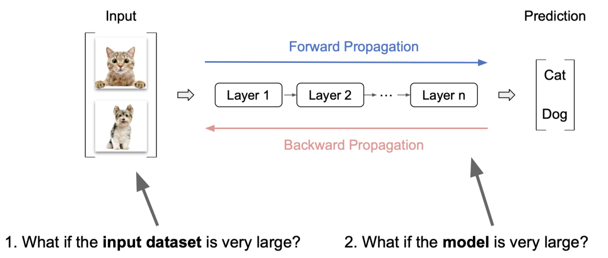
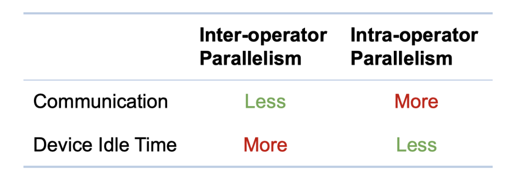
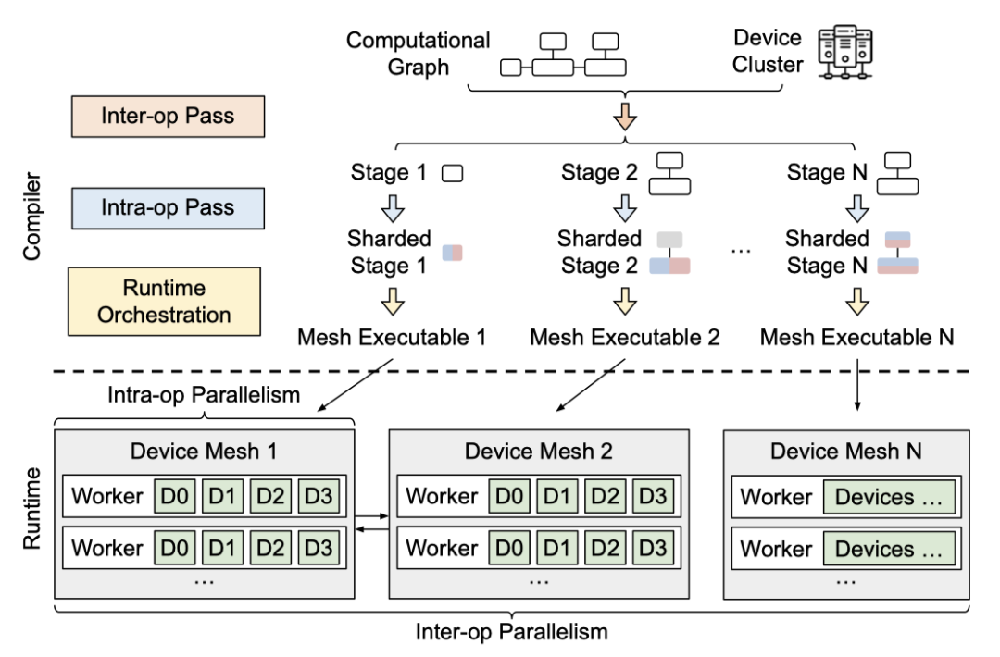
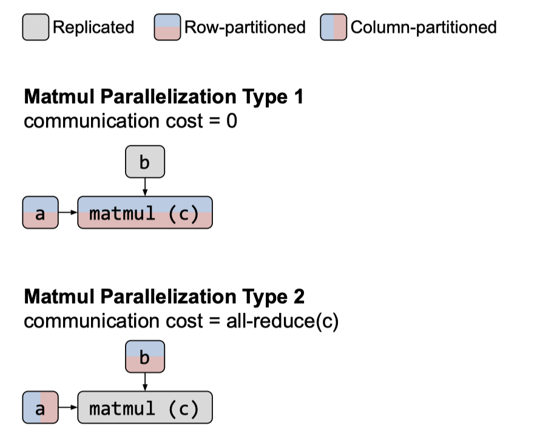
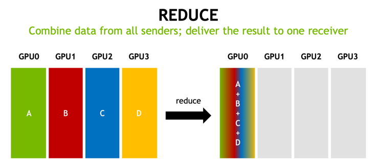
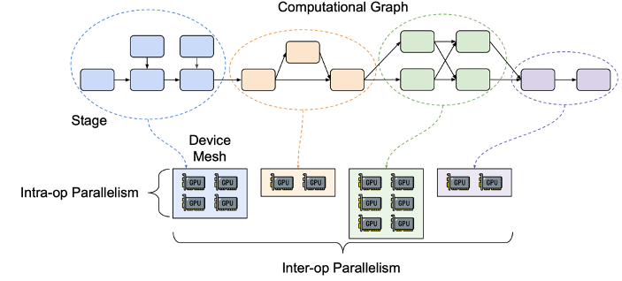
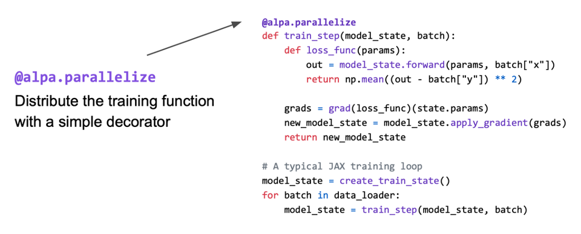
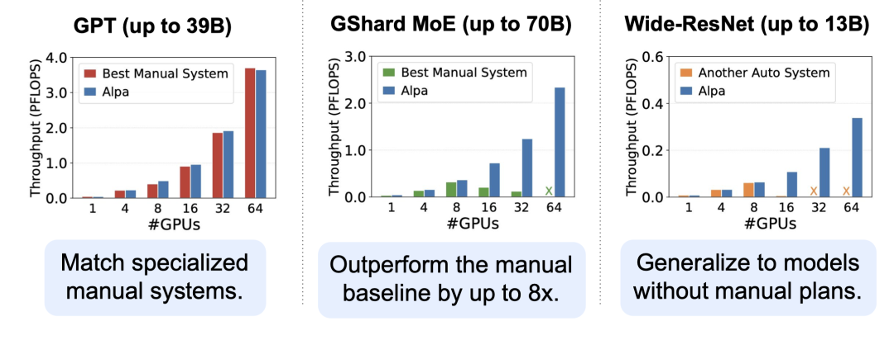

随着以 ChatGPT 为代表的大模型（LLM）技术的迅速发展，越来越多的企业和研究团队将目光聚焦于如何将大模型技术应用于自己的行业中，各种各样针对性的 Prompt 方法被提出来提高大模型技术在特定领域的适用性，以提高大模型技术的可靠性。除了提高 LLM 技术的适用性之外，我们还需要一个高性能且易于使用的机器学习基础设施来支撑 LLM 的训练和推理。

现代 LLM 的参数大小为数千亿，例如， OPT-175B 模型需要 350GB 的 GPU 内存来容纳模型参数，这已经超过了单个设备或主机的 GPU 内存，而即使是当前最先进的 NVIDIA A100 和 H100 GPU 显卡也仅只有 40GB / 80GB GPU 内存。因此，为了能够高效地运行 LLM 的训练和推理任务，工程师需要对模型进行划分，然后将子模型调度到能够满足计算内存需求的 GPU 主机上进行并行计算。

也就是说，对 LLM 的划分和编排调度成为了 LLM 的训练和推理的关键。下图展示了 NIVIDA 推荐的 LLM 训练和推理任务计算的技术栈。自顶向下来看，在开发人员对模型进行定义后，我们可以用 Alpa 对模型进行自动化的并行划分，然后基于 Ray 编排调度子任务，最后再由 GPU 显卡运行每个子任务。

今天我们先来分享由 UC Berkeley 提出的 Alpa 框架，等夏至我们将继续分享 另外一个 Ray 的框架。Alpa 的原型是来自于 2022 年 UC Berkeley Rise Lab 团队发表在 CCF A 类的操作系统顶级会议 OSDI 上的论文 Alpa: Automating Inter- and Intra-Operator Parallelism for Distributed Deep Learning。

### 
2022_OSDI_Alpa: Automating Inter- and Intra-Operator Parallelism for Distributed Deep Learning

#### **论文背景** 

在训练大模型的时候，我们通常会遇到两个与 “大” 相关的问题：一是输入的数据集非常大，二是模型非常大。

对于输入的数据集非常大的问题，我们可以通过对数据的并行处理，将输入的数据划分成多个数据集，然后在每个机器上单独进行训练。

但如果输入的模型非常大呢？ 例如单个 GPU 最大内存是  32 GB，而模型需要  350 GB  进行存储，这个时候单个  GPU  是无法满足训练的需求的。

这个时候问题就变成了如何对 Computational graph 进行划分和编排调度，让一个大模型的子任务能够并行地运行在有限内存的  GPU  设备上，最后再对子任务的结果进行组合获得最终的结果。

#### **论文动机**

对给定一个 computational graph 和对应的  GPU  设备，

典型的 computational graph 划分方式有 2 种：

1.  Inter-operator Parallelism：算子（operator）间并行

2. Intra-operator Parallelism：算子（operator）内并行

这两种并行方式各有优缺点，Inter-operator Parallelism 的方式可能会因为算子之间的等待导致更多的空闲设备，而 Intra-operator Parallelism 则会因为算子内部的数据分发导致更多的数据传输成本。

为了克服以上两种并行方式的缺陷，我们可以很直观地想到可以将 Intra-op erator and Inter-operator Parallelism 组合起来，实现在最少的数据传输成本的条件下利用到更多的设备，从而尽快地训练完模型，这就是本文最核心的动机。

#### **论文方法**

基于将 Intra-operator and Inter-operator Parallelism 组合起来加速模型训练的动机，论文提出了一个自动为大型 Deep Learning 模型找到并执行最佳的 Intra-operator and Inter-operator Parallelism 的编译器：Alpa。

Alpa 以 computational graph 和  device cluster 作为输入，输出并行方案。下图展示了它的整体架构，自上而下可分为 Inter-operator Parallelism 负责解决如何划分 Stage ，Stage 间如何流水线并行。Intra-operator Parallelism 负责解决如何划分 Stage 中的算子内部然后并行运行到不同的设备上。最后  Runtime Orchestration 进行编译优化。

1. Inter-operator Parallelism

在 Inter-operator Parallelism 划分阶段，Alpa 首先将 Computational graph 划分成  Stage

然后 Alpa 以最小化 Pipeline 的运行延迟作为目标将 Stage 流水线化分配到多个设备上并行计算

对这个优化问题，Alpa 通过动态规划解决，具体的建模过程比较复杂，建议直接参考原论文

2. Intra-operator Parallelism

在 Intra-operator Parallelism 划分阶段，Alpa 将每个 stage 中的 operator 进行进一步的划分。对于一个 operator，可以按 tensor 的行划分，也可以按  tensor 的列划分。

在  Intra-operator Parallelism 阶段，会由于不同算子之间按行或者按列划分导致额外的  Communication cost,  如将算子按列划分在  GPU0-3  并行计算完后，需要将结果发送到 GPU0 进行汇总。

此外还包括 Re-partition Communication Cost， 如从按行划分转换为按列划分，有  All-Gather 的开销。

其他的开销建议可以参考旷视研究院周亦庄博士 《利用MegEngine的分布式通信算子实现复杂的并行训练》的  PPT，这里不再详细分享。

因此，在 Intra-operator Parallelism 除了考虑计算的开销外，还需考虑 communication cost 的开销，最后 Intra-operator Parallelism  的优化目标为最小化 computation  和 communication cost ， 然后 Alpa 用整数线性规划来解决此优化问题

最后将 Inter-operator 和  Intra-operator Parallelism 组合，即获得了 Alpa 最核心的分层优化方案

3. Runtime Orchestration

在编译阶段，Alpa 采用 MPMD 风格的运行时，为每个设备网格生成不同的静态执行指令序列

#### **论文结果**

Alpa 基于Jax、HLO、RAY 实现完整的框架并开源到 https://github.com/alpa-projects/alpa 

Alpa 在使用时只需要在函数前加一句  @alpa.parallelize 即可

论文首先与之前的工作对比了不同调优方式的吞吐量，可以发现 Alpa 可以与最优的手动调整获得相似的结果，而且通用性更高

论文然后做了 Inter-Operator 和 Intra-Operator 的消融实验，整合了 Inter-Operator 和 Intra-Operator 的 Alpa 能够获得更高的吞吐

将神经网络扩展到数千亿个参数，使得GPT-3等取得了巨大的突破，但训练和服务这些大规模的神经网络需要复杂的分布式系统技术。Alpa是一个适用于训练和推理大规模神经网络的自动化编译器。 它只用几行代码就能实现大规模分布式训练和推理的并行自动化。 

Alpa 是一篇工作量非常大的论文，在上文中，我们只是简单的介绍了  Alpa 的核心思想，原文的内容远比我们介绍的复杂，同时论文的工程量也是相当的大，绝对是一篇  OSDI  级别的优秀论文。这就是国际上顶尖的研究团队。

Alpa 开源一年目前在Github 上已经有超过 2.5K 的Star，背靠   UC Berkeley Rise Lab 和  Ray ，我们有理由相信它还会有更好的发展，让我们一起期待它的未来吧～ 

> 论文链接：[https://www.usenix.org/system/files/osdi22-zheng-lianmin.pdf](https://www.usenix.org/system/files/osdi22-zheng-lianmin.pdf)
> 代码链接：[https://github.com/alpa-projects/alpa](https://github.com/alpa-projects/alpa)

CloudWeekly 每周分享与云计算相关论文，相关的论文集被收纳到 github 仓库 [https://github.com/IntelligentDDS/awesome-papers](https://github.com/IntelligentDDS/awesome-papers)