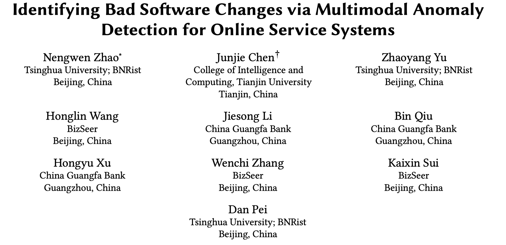
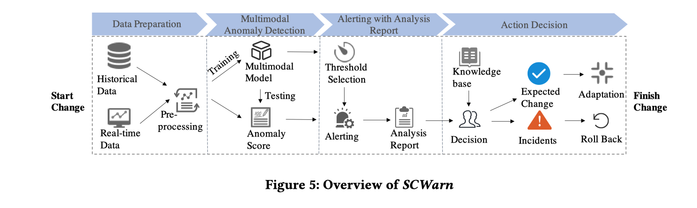
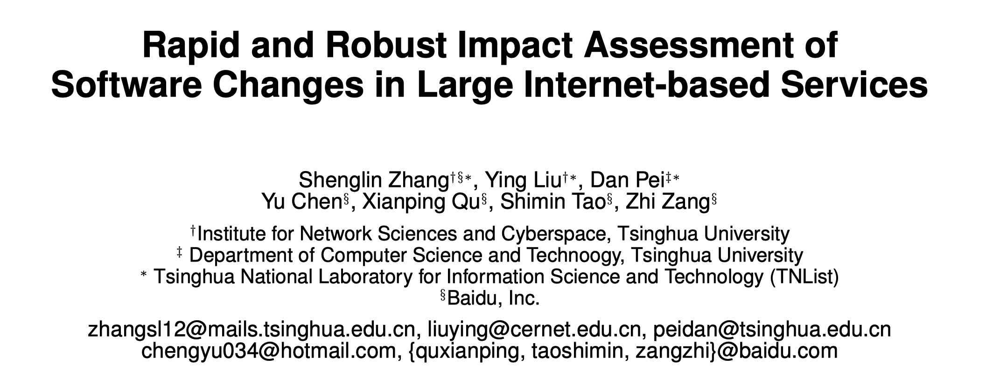
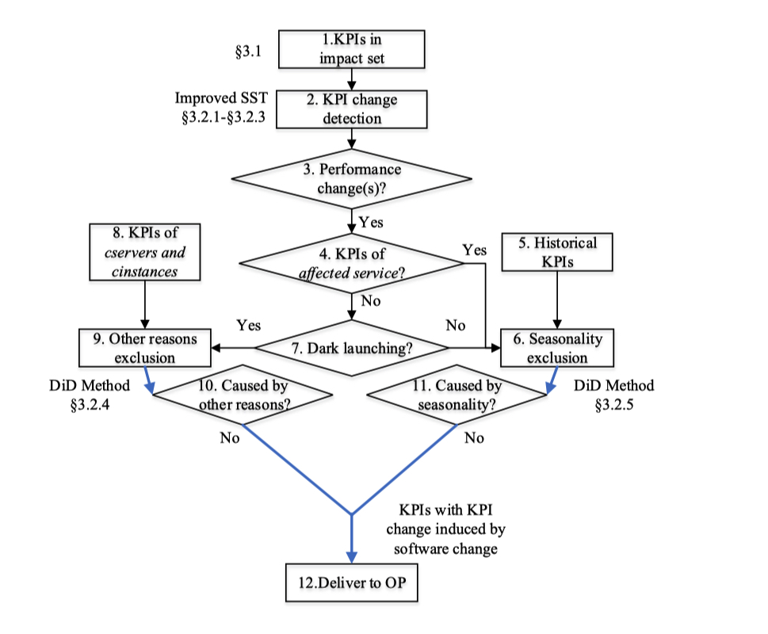
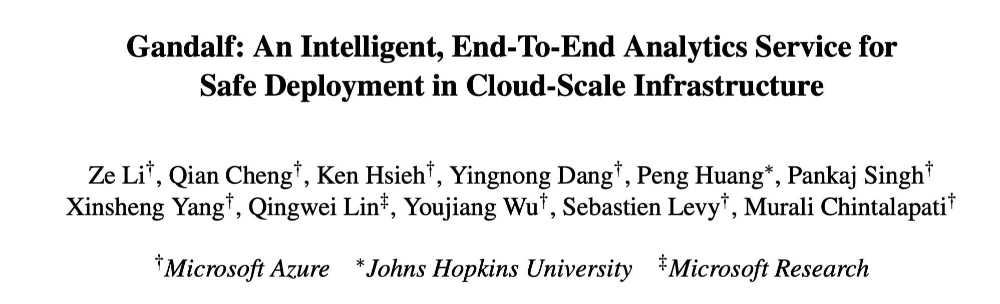
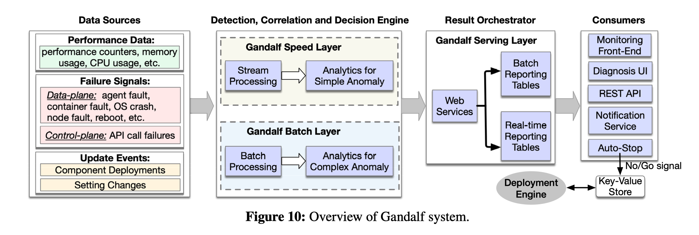

微服务架构和CI/CD的出现让现代应用快速和频繁的开发和发布新的特性成为可能，但是代码频繁的变更为系统引入了更多的不稳定因素。根据 Google SRE book 的描述有 70% 的 incident 都是由变更导致的，因此及时的发现异常的变更，尽快的采取 rollback 的策略是非常重要的。本文介绍几个前沿的异常变更识别方法。

## 
 01

### 
21_FSE_Identifying Bad Software Changes via Multimodal Anomaly Detection for Online Service Systems

**论文简介:** 随着微服务架构和 CICD 的普遍应用以及业务的压力，现代应用的变更越来越频繁。频繁的变更可以带来业务的快速迭代，但也增大了系统发生故障的概率。这篇论文首先对一个银行系统的历史故障进行了分析，然后得出 50 % 的故障是由于变更导致的，并且不同的变更反应在不同的 Metric 和 Log 上。因此作者提出将 Log 时序化，并通过融合Metric 和 Log 训练一个 LSTM 模型用于异常检测，如果LSTM模型预测值与实际值相差较大则会进行告警。 

**个人评论：** 清华大学裴丹老师团队和天津大学陈俊洁老师合作的论文，论文发表在 CCF A 类会议 FSE 2021 上，论文从结构和语言上都非常值得学习。但是不是很能够理解变更系统引入日志，因为很有可能程序员在变更的时候就会打印新的日志，那这样也会被认定为程序出现了新的日志从而产生告警。

> 论文链接：[https://netman.aiops.org/wp-content/uploads/2021/09/SCWarn.pdf](https://netman.aiops.org/wp-content/uploads/2021/09/SCWarn.pdf)
> 
> 代码链接：[https://github.com/FSEwork/SCWarn](https://github.com/FSEwork/SCWarn)

## 
 02

### 
15_CoNEXT_Rapid and Robust Impact Assessment of Software Changes in Large Internet-based Services

**论文简介:** 当服务更新后，论文首先获得已更新服务实例、changed 服务以及 affected 服务的 KPI，然后基于一个改进版的 Singular Spectrum Transform 检测出异常的 KPI 。如果changed 服务发生性能变化，则基于 difference-in-difference (DiD) 检测属于changed 服务的已更新的服务实例（tinstance）和未更新服务实例（cinstance）的KPI 是否存在差异，如果存在差异可以直观的理解为更新导致他们的差异。如果是上游的 affected 服务的 KPI 发生变化，那则将服务更新前的 KPI 视为（cservice）和更新后的 KPI 视为（tservice），然后同样基于 DiD 检测他们是否有显著性的差异，如果存在差异则认为 affected 服务的变化是由于下游服务更新导致的。

**个人评论：** 论文是南开大学张圣林老师在读博士时在百度的工作，发表在 CCF B 类会议 CoNEXT 2015 上，论文只判断单个变更是否异常，如果上下游都有变更，很难进行处理。

> 论文链接：[https://conferences2.sigcomm.org/co-next/2015/img/papers/conext15-final2.pdf](https://conferences2.sigcomm.org/co-next/2015/img/papers/conext15-final2.pdf)

## 
 03

### 
20_NSDI_Gandalf: An Intelligent, End-To-End Analytics Service for Safe Deployment in Large-Scale Cloud Infrastructure

**论文简介:** 当程序变更后，论文先统计失败的日志事件出现的次数，然后基于 Holt-Winters forecasting 检测出现异常的日志事件并判定为 Error。 对每一个 Error ，Gandalf 会计算它与变更的时空相关性。时间相关性基于假设“对一个变更，如果一个故障发生时间与变更的时间越接近，他们更相关”。空间相关性基于假设“在变更期间，未变更节点中发生的故障百分比越高，变更和故障之间的因果关系越低”。最后对于每个变更的得分，Gandalf 通过 Gaussian discriminant classifier 判断是否要继续变更还是 rollback。

 

**个人评论：** Gandalf 是 MicroSoft Azure 发表在 CCF A 类会议 NSDI 的论文，应该是有实际落地在用的。论文在投票阶段的描述应该是写错了，导致很难理解投票与反对的关系，建议可以看一下他的 presentation 来帮助理解。

> 论文链接：[https://www.usenix.org/conference/nsdi20/presentation/li](https://www.usenix.org/conference/nsdi20/presentation/li)

CloudWeekly 每周分享与云计算相关论文，相关的论文集被收纳到 github 仓库 https://github.com/IntelligentDDS/awesome-papers