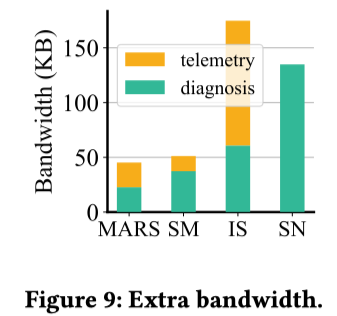
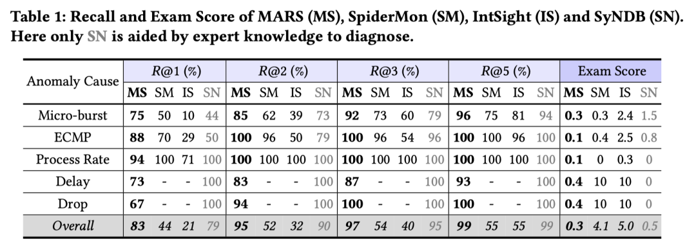
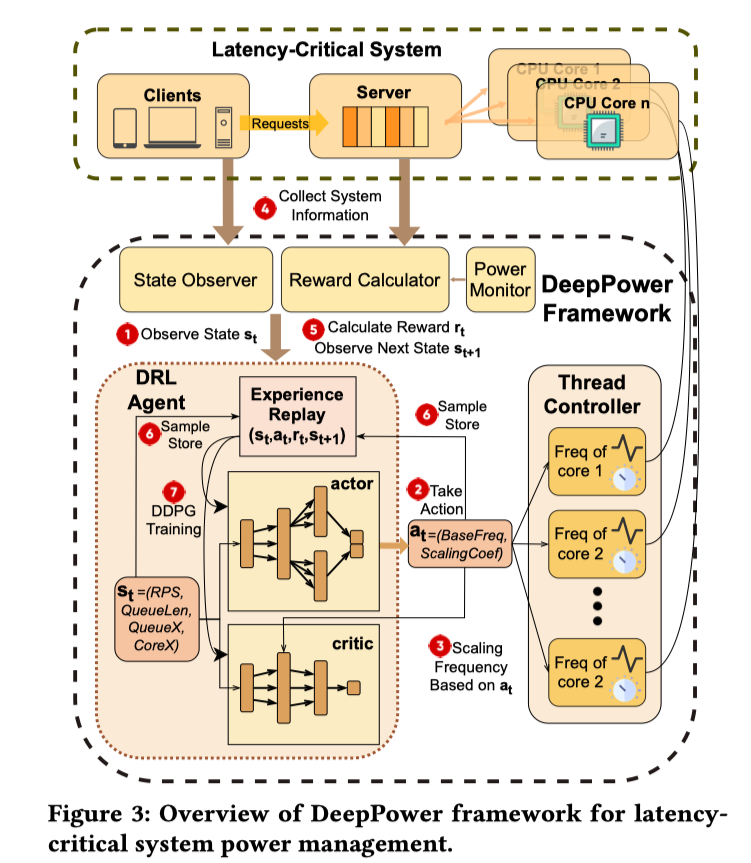
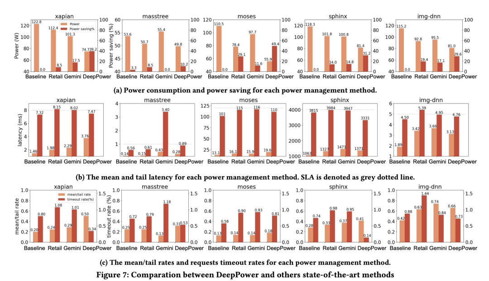

International Conference on Parallel Processing （ICPP）并行处理国际会议是世界上历史最悠久的并行计算学术会议之一，今已经在全球连续举办了52届。ICPP 被中国计算机学会（CCF）推荐国际学术会议列表认定为B类会议，是计算机并行计算领域最有学术影响力的顶级会议之一。

ICPP 2023 将于2023年8月7日至10日在犹他州盐湖城举行，我们实验室这次共有两篇论文被接收为长文。下面我们首次曝光这两个工作，欢迎大家关注我们的公众号，我们会持续推送最新的研究进展。

## 
 MARS: Fault Localization in Programmable Networking Systems with Low-cost In-Band Network Telemetry

### 论文背景

在大规模数据中心中，除了服务器外，网络设备是重要的组成部分。软件定义网络（Software Defined Network，SDN）是由美国斯坦福大学 CLean State课题研究组提出的一种新型网络创新架构，是网络虚拟化的一种实现方式。其通过将网络设备的控制面与数据面分离开来，实现了网络流量的灵活控制。如今 SDN 交换机已被各大云数据中心广泛使用。 

由于一个 SDN 交换机通常负责一个区域的服务器网络，因此一旦 SDN 交换机出现故障，对上层应用的影响甚至大于服务器出现故障时的影响。因此在庞大的数据中心中，对 SDN 交换机进行实时监控和诊断对保证上层应用的可靠性来说非常重要。

但是当前的 SDN 交换机监控和诊断方法存在以下几个局限性：

- 当前的 SDN 交换机监控方法监控开销大，会带来额外的流量影响网络性能
- 当前的 SDN 交换机异常检测方法，依赖于静态阈值，需要大量的专家知识
- 当前的 SDN 交换机根因定位方法针对的故障类型有限，定位精度差

### 论文方法

为了克服已有工作的局限性，我们提出了一个端到端的  SDN  网络环境监控、异常检测、根因定位系统：MARS。下图展现了  MARS  的整体架构。

MARS 的贡献主要包括以下几点：

- 按需监控：我们提出了一种新颖的路径感知方法来监控网络流量并按需报告数据。这种方法与网络传输路径的长度无关，不会随着网络规模的增大而产生额外的开销。
- 自适应异常检测：我们提出了一种利用 reservoir model 自适应更新网络控制面中的阈值来进行 In-Network 异常检测的方法
- 自动化根因定位，我们将将频繁序列挖掘和基于 Spectrum 的故障定位结合起来，实现了多个层次（flow level, switch level, and port level）的自动化根因定位 。

### 论文实验

与对比方法相比，MARS 具有最小的 Bandwidth 开销和最小的 Diagnosis 开销。尽管 SpiderMon 和 MARS 的 Bandwidth 开销相近，但 MARS 以更全面的方式收集信息，提供了更维度和更彻底的根本原因分析。

在根因定位方面，MARS 能够定位更多类型的故障，在  Top2 实现  95% 的召回率。

> 论文链接：[https://yuxiaoba.github.io/publication/mars23/mars23.pdf](https://yuxiaoba.github.io/publication/mars23/mars23.pdf)

## 
 DeepPower: Deep Reinforcement Learning based Power Management for Latency Critical Applications in Multi-core Systems

### 论文背景

延迟敏感型(Latency-Critical) 应用是在现代数据中心中占有很高的比例，为用户提供电子支付、搜索等各种服务。Latency-Critical 顾名思义，是一种对延迟要求非常高（毫秒级）的应用，为了确保用户在短时间内收到响应，每个请求的尾部延迟应保持在特定水平以下，通常为几毫秒。

当前数据中心通常通过长期保持较高的 CPU 频率以满足延迟要求，但是这种方式会导致 CPU 利用率低和功耗过大。现代处理器的 Dynamic voltage/frequency scaling (DVFS) 技术可以我们在运行时以几微秒的延迟动态调整每个线程的CPU 频率。因此，一个直观的节省能耗的想法是在应用高负载时将CPU频率设置在高水平，以提高其在高负载下的计算能力，从而确保QoS要求。当应用负载较低时，降低 CPU 频率，从而降低整体功耗。这也是本文的核心思想。

### 论文方法

本文提出了 DeepPower，它是一个为 Latency-Critical 应用设计的的基于深度强化学习（DRL）的能耗管理解决方案。如下图所示，DeepPower 由两个关键组件组成，一个用于监控系统负载变化的 DRL Agent 和一个用于CPU频率调整的 Thread Controller。DRL Agent 以较长的间隔调整 Thread Controller 的参数，而 Thread Controller 以较短的间隔调整CPU频率，实现分级  CPU  频率控制。

DeepPower 的贡献主要包括以下几点：
- 据我们所知，DeepPower 是第一个在  Latency-Critica 应用中使用 DRL进行能耗管理的方法。由于 DRL 强大的学习能力，学习到的策略比启发式的方法更有效，从而使应用功耗降低更多
- DeepPower 提出了一种分级 CPU  频率控制机制。DRL Agent 以较长的间隔调整 Thread Controller 的参数，而 Thread Controller 以较短的间隔调整CPU频率。这种控制机制使 DeepPower 能够适应动态工作负载，并实现细粒度的频率调整

### 论文结果

与 Gemini 和 ReTail 等最先进的方法相比，DeepPower 可以在满足尾部延迟限制的同时降低 28.4% 的功耗 。

为了进一步了解DeepPower的优势，我们在图 9 中可视化了毫秒级延迟应用程序 Xapian 的运行过程，在图 10 中可视化了秒级延迟应用软件 Sphinx 。DeepPower 通过在请求处理过程中逐渐提高 CP频率来实现细粒度控制，如图 9a 和图 10a 所示。在请求处理期间，Thread Controller 缓慢地增加 CPU 频率。结果，CPU 频率在大部分时间内没有被提升到其最大水平。相反，Retail 和 Gemini 选择较粗粒度的频率（即，每个请求一次或两次）。这使得他们在许多情况下不得不提高CPU频率（即，出现长队列或请求超时），从而导致能耗更高。

> 论文链接：[https://yuxiaoba.github.io/publication/deeppower23/deeppower23.pdf](https://yuxiaoba.github.io/publication/deeppower23/deeppower23.pdf)

CloudWeekly 每周分享与云计算相关论文，相关的论文集被收纳到 github 仓库 [https://github.com/IntelligentDDS/awesome-papers](https://github.com/IntelligentDDS/awesome-papers)