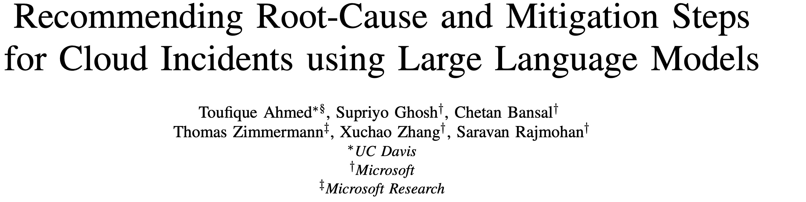
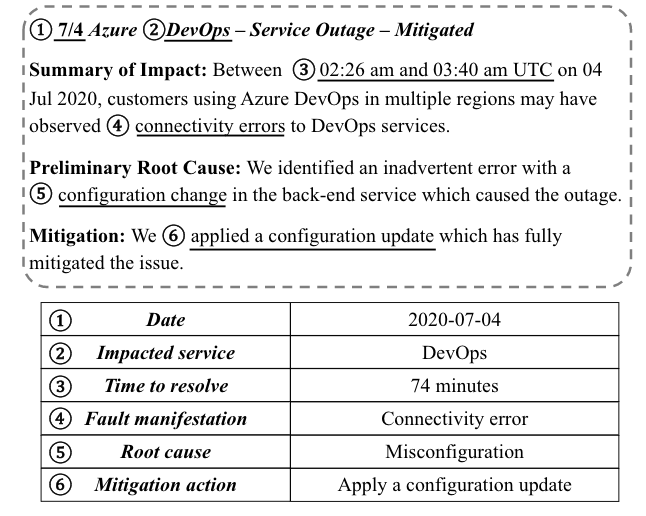
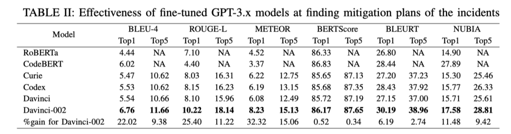
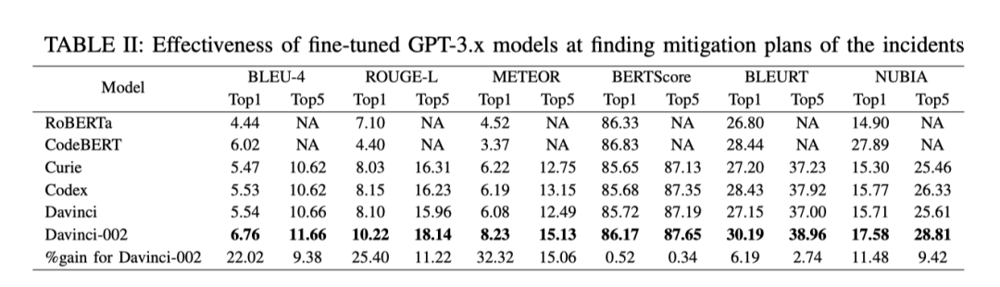
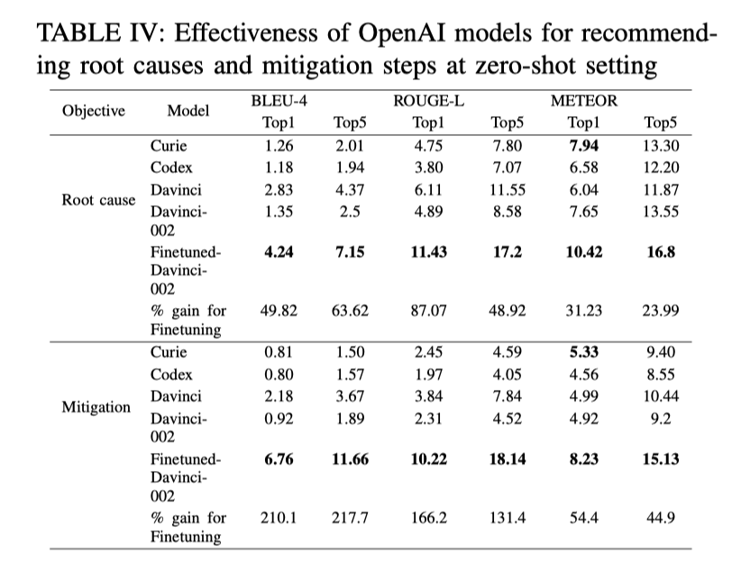
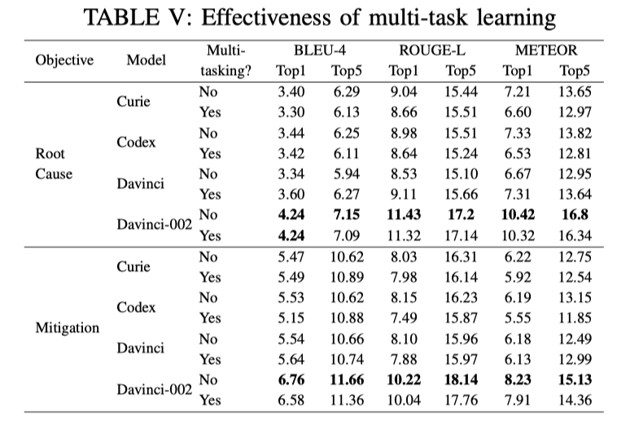
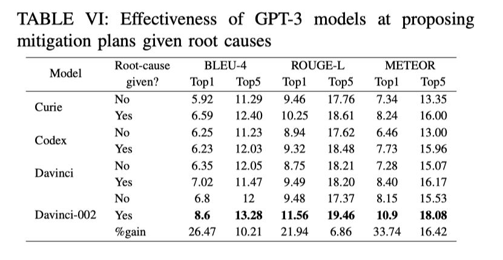
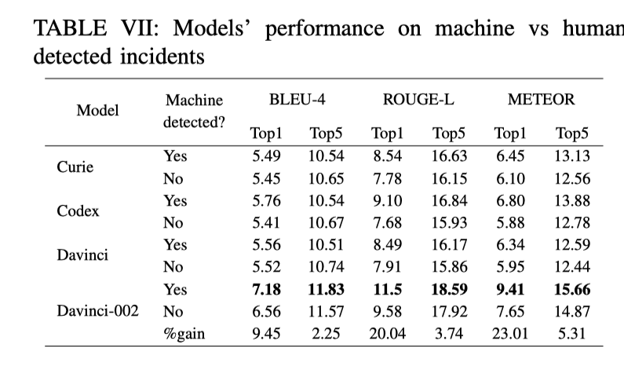
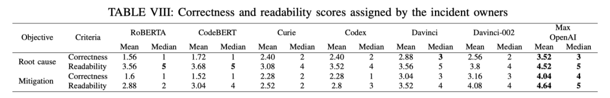
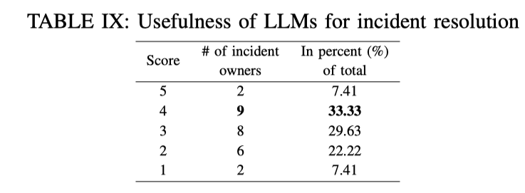

今天我们来分享 ICSE 2023 上 Microsoft 团队发表的一篇将 GPT-3.x 应用在AIOps 领域的一篇论文 Recommending Root-Cause and Mitigation Steps for Cloud Incidents using Large Language Models。

CSE 全称为 International Conference on Software Engineering，是软件工程领域 CCF A 类会议，2023 年收到 796 篇投稿，录用了 209 篇，录用率为 26%。

### 
2023_ICSE_Recommending Root-Cause and Mitigation Steps for Cloud Incidents using Large Language Models

#### **论文背景** 

在大型的 IT 软件系统中，由于软件的变更、运维的操作和外部环境变化等诸多因素，经常出现各种类型的故障。在故障发生后，运维工程师需要快速地进行根因定位并采取相应的恢复措施，以保障系统的可用性。

为了记录故障的全生命周期，运维工程师通过以文本和图片的形式记录故障的发生、检测、定位和修复过程，这个记录也被称为 Incident 。下图展现了一个典型的 Incident 样例。

#### **论文动机**

从上面的图可以看出，故障的 incident 是一种自然语言的形式，GPT-3.x 对自然语言处理的成功让 Microsoft 的研究人员意识到，有可能将 GPT-3.x 应用到incident 分析中，即将 incident 的标题和摘要（如错误的信息，异常的表现）作为输入，自动化生成故障的根因和推荐故障修复的措施。

为了将  GPT-3.x 应用到 incident 分析中， 作者收集了 Microsoft 中从2018年1月1日至2022年7月15日期间的超过 40,000 个 incident  数据，得到了 57,520 个根因定位样例和 8,300 个故障修复样例。然后制定了六个研究问题：

- GPT-3.x 是否能够有效诊断 incident 的根因？
- GPT-3.x 是否能够有效地推荐缓解 incident 的措施？
- 是否需要对 GPT-3.x 进行微调以适应 incident 分析场景 ？
- Multi-task learning 能提高 GPT-3.x 模型在根因诊断和故障修复推荐方面的准确率吗？
- 如果已确定根因， GPT-3.x 是否能找到更好的故障修复措施？
- GPT-3.x 更擅长处理 machine-detected incident 还是更擅长处理human-detected incident ？

#### **论文方法**

为了研究上面的六个问题，论文选取了两个当前最先进的 encoder-decoder 模型：
- RoBERTa : 训练数据集只包含文本 NLP 模型 
- CodeBERT：训练数据集包含文本和代码的 NLP 模型， 125M 个参数

此外还选取了 4 个 OpenAI 的 GPT 模型：

- Curie:  训练数据集包含文本的，速度最快的GPT-3 模型，6.7 Billion 个参数
- CodeX: 训练数据集包含文本和代码的 GPT-3 模型， 12 Billion 个参数
- Davinci: 训练数据集只包含文本的 GPT-3.5 模型，175 Billion 个参数
- Code-davinci-002:  训练数据集包含文本和代码的 GPT-3.5 模型，175 Billion个参数 

在根因定位方面，论文选择了 35820， 3000，2000 根因案例作为 training，testing ，validation。

在故障恢复推荐方面，论文选择了 5455， 2000， 500 故障恢复案例作为training，testing ，validation。

为了验证方法的效果，论文还设置了六个 NLP 领域的指标 BLEU-4，ROUGE-L，METEOR，BERTScore，BLEURT，NUBIA。这六个指标解释起来有点复杂，简单的说，它们都是衡量生成的文本与参考的文本的相似程度，相似程度越高得分越高，说明与实际的根因定位和修复策略越接近。

除此之外，论文还将最近 2 个月的 50 个 incident 的结果与 incident 对应负责人进行采访，让他们对结果的正确性和可读性进行打分。

#### **论文结果**

1. GPT-3.x 是否能够有效诊断 incident 的根因？

直观地看上表，我们可以发现 GPT-3.x  的结果似乎与 BERT 模型的结果相差不大。文章解释说是因为：NLP 的指标不适用于对根因定位和故障修复措施的衡量。例如 “代码中有一个bug” 是 incident 中非常常见和通用的句子，可能是任何根因的一部分，因此 BERT 模型只需复制特定的字段就可以最大限度地提高准确率。

虽然 NLP 指标的结果差不多，但是作者在采访中发现，大多被采访者抱怨 BERT 模型返回的结果都是套路，例如返回 “代码中有一个bug”对故障的定位没有任何帮助。而 GPT-3.x  返回的结果则会更有针对性，更有利于根因定位。

2. GPT-3.x 是否能够有效地推荐缓解 incident 的措施？

在故障修复措施这里，结果也是类似的， GPT-3.x  的结果似乎与 BERT 模型的结果相差不大。这是因为 incident 的故障修复措施中同样包含一些常见的句子如 “问题自行缓解”，“已部署到所有地区” ，导致总是把这些句子输出就获得了一个不错的结果，但是这些句子没有用处。但总的来说， GPT-3.x 的结果还是会好一些。

3. 是否需要对 GPT-3.x 进行微调以适应 incident 分析场景 ？

通用的 GPT-3 模型 pre-train 数据集中是不包含 incident 数据的，为了让它适应 incident 的场景，作者在 training 的数据集中使用包含 incident 数据对模型进行 find-tuned。从上表中可以发现，微调后的模型是要比没有微调的结果要好。

4. Multi-task learning  能提高 GPT-3.x 模型在根因诊断和故障修复推荐方面的准确率吗？

前面的 GPT 模型是将根因定位和故障修复的任务分开训练，这一块论文将两个任务的训练数据作为输入一起训练，然后使用相应的测试集分别测试模型。总的来说，从表 V 中可以观察到 Multi-task learning 并没有显著优于单任务。论文认为这主要是因为根因和缓解措施之间缺乏联系。

5.  如果已确定根因， GPT-3.x 是否能找到更好的缓解措施？

上表的结果说明额外的根因信息可以给故障修复带来的相当大的性能增益。也就是说，如果根因定位准确， GPT-3.x 能找到更好的缓解措施。

6. GPT-3.x 更擅长处理 machine-detected incident 还是更擅长处理human-detected incident ？

上表的结果表明 machine-detected incident  的结果可以比 human-detected incident 更好。这是因为 machine-detected incident 通常遵循某些模式，这些模式更容易被机器学习模型识别。

7. 微软工程师对 GPT 生成结果的反馈采访

上表中 incident 负责人为 RoBERTa 和 CodeBERT 模型打了较低的正确性分数。尽管 GPT-3.x 的正确性得分在 2.28 到 3.16 之间，但工程师指出，GPT-3.x 模型推荐了有效的根因和缓解措施，或者可以给予工程师有价值的建议。

#### **论文小结**

最后再来小结一下，本篇论文是我看到的在 AIOps 领域第一个使用 LLM 大模型的探索工作，论文对微软超过 40,000 个 incident 进行研究，证明先进的大型语言模型，可以有效地帮助 incident 管理，特别是在根因诊断和故障修复推荐方面。

这项工作是一个门槛非常高的工作，数据集、模型训练的成本都不是我这种小 Phd 可以完成的，非常羡慕能够完成一个这样的工作。同时也非常羡慕 Microsoft 的学术嗅觉，在我还没有意识到 GPT 的强悍之前，他们已经把工作做完了，这大概就是世界顶级团队。

论文的开头画了一个大饼，需要输入故障的描述和表现就可以自动化生成故障的根因和修复措施。但是论文的实验结果又不是很客观，缺乏了一个合理的指标对结果进行量化，总体上感觉没有那么让人信服。如果能够提出一个可以量化本文结果的指标，那也是一个很大的贡献。

现在的 GPT-4 据说已经是可以处理多模态的数据了，那么运维日常使用的 Metric、Trace 、 Log 等数据是不是也可以与 Incident 数据一起打包进模型里呢？也许我们苦苦追寻的基于多模态数据的根因定位就这么粗暴地被解决了。

除此之外，GPT 的可解释性是比较差的，日常的使用就会有一种一本正经地胡说八道的问题，如果在故障处理的时候，它一本正经地胡说，很可能进行错误的指引，把工程师往坑里带，反而会延长故障的修复时间。用一种不是很可靠的方法，去解决可靠性的问题，多少还是感觉有点让人心慌。期待这个方向有更有意思的东西！

> 论文链接：[https://arxiv.org/pdf/2301.03797.pdf](https://arxiv.org/pdf/2301.03797.pdf)

CloudWeekly 每周分享与云计算相关论文，相关的论文集被收纳到 github 仓库 [https://github.com/IntelligentDDS/awesome-papers](https://github.com/IntelligentDDS/awesome-papers)