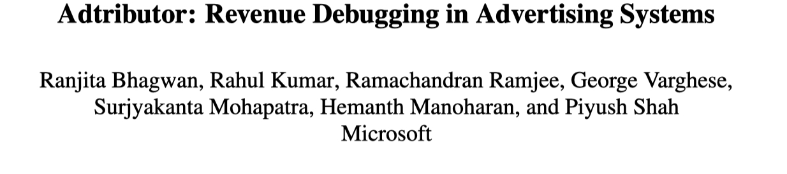
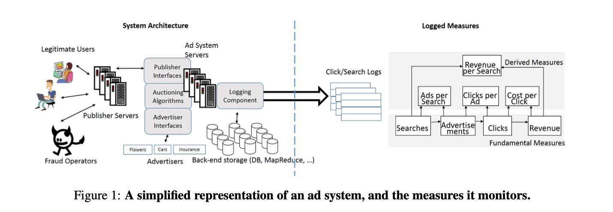
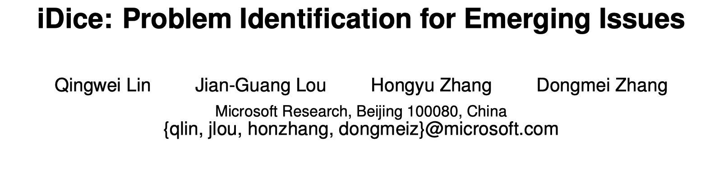
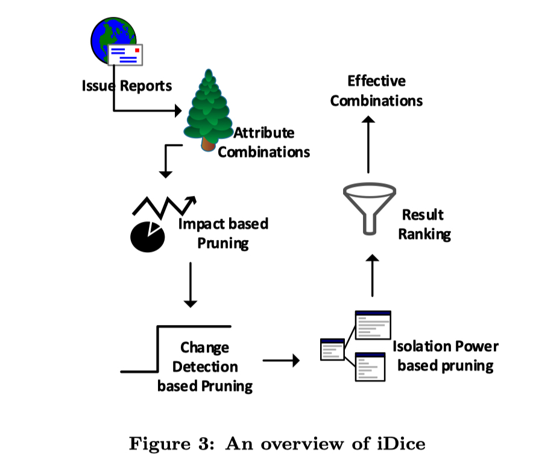
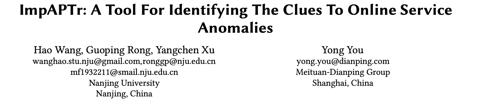
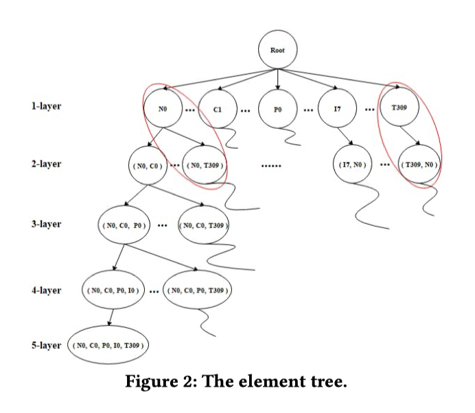

之前我总结了两种常见的基于 Metric 的根因定位算法 [基于 Metrics 的根因定位 (一)：故障刻画](https://yuxiaoba.github.io/post/metric_based_rca_1/) 和  [基于 Metrics 的根因定位 (二)：因果关系图](https://yuxiaoba.github.io/post/metric_based_rca_2/) 。这一次介绍第三种基于 Metric 的根因定位算法: 多维下钻。 

在 SRE 检测到 KPI 发生异常时（如响应成功率下降），还面临一个灵魂拷问：为什么发生异常了？（成功率为什么下降了？），这个时候我们需要增加维的层次，从而可以由粗粒度的数据到细粒度的数据来观察数据。

例如下表我们发现某服务的当前总的失败请求数目比前一个时间点增加了很多，工程师会进一步挖掘失败请求的属性，比如查看数据中心的元素，发现广州的数据中心存在异常导致的这次故障，这就是一个简单的多维下钻的样例。

| 数据中心 | 前一时间点失败请求数 | 当前时间失败请求数 | 差异  |
| :------: | :------------------: | :----------------: | :---: |
|   广州   |          10          |        1000        |  990  |
|   上海   |          5           |         5          |
|   北京   |          10          |         11         |   1   |
|   合计   |          25          |        1016        |  991  |

## 
 01

### 
14_NSDI_Adtributor: Revenue Debugging in Advertising Systems

**论文简介:** 论文针对广告营收领域的 revenue debugging问题，将多维根因分析问题分解为多个单维根因分析问题，提出了的 Adtributor 算法，并分别针对量值与率值两类指标进行多维度的根因分析。整体思路如下：

1. 利用 ARMA 模型进行异常检测。根据8周的历史数据，考虑到正常的时间和星期的波动，生成一个基于模型的测量值预测。然后，将实际值与预测值进行比较：当一个测量值的实际值与预测值有明显差异时，将产生一个异常警报。

2. 计算每个维度下每个元素的 explanatory power （单个元素预测值与实际值的差异和整个维度预测值与实际值差异的比值，论文公式 4） 与 surprise 值（可直观理解为预测值与实际值变化的程度，论文公式 5），定位出每个维度下的异常元素集合，最后根据每个维度总的 surprise  值大小汇总输出根因集合。

**个人评论：** Microsoft 2014 年发表在 NSDI （CCF A）上的论文，论文可以说是基于 Metrics 的多维下钻分析的开山之作，论文在 Mcirosoft 实际落地，可解释性比较强，后面的多维下钻的工作也大多在其基础之上进行创新。

> 论文链接：[https://www.usenix.org/system/files/conference/nsdi14/nsdi14-paper-bhagwan.pdf](https://www.usenix.org/system/files/conference/nsdi14/nsdi14-paper-bhagwan.pdf)

## 
 02

### 
16_ICSE_iDice: Problem Identification for Emerging Issues

**论文简介:** 软件在发布时一般会有很多分类属性（例如版本号，地域，操作平台等），如果发布有异常，用户通过会上报一些反馈的 Issue，此时需要运维工程师能够快速定位究竟是哪些属性造成了 Issue 的上升，提升响应的速度。文章以 Issue 的上升作为告警，通过分析一个时间窗口内 Issue 的属性的组合，找出最有可能导致 Issue 上升的最小属性组合。在搜索空间过大的问题上论文使用了启发式的三个剪枝策略来应对：

- Impact based Pruning：一个有用的属性必须引起较大数量变化

- Change Detection based Pruning: 一个有用的属性组合必须在时间点上符合变化特征

- Isolation Power based Prunning: 合并多余属性组合

**个人评论：** MSRA 林庆维研究员 2016 年发表在 ICSE（CCF A）的论文。论文针对性地处理了用户反馈 Issue 的维度下钻，并在微软落地，剪枝的策略值得学习。

> 论文链接：[http://hongyujohn.github.io/iDice.pdf](http://hongyujohn.github.io/iDice.pdf)

## 
 03

### 
20_ASE_ImpAPTr: A Tool For Identifying The Clues To Online Service Anomalies

**论文简介:** 论文是一个广度优先的多维下钻根因定位算法，ImpAPTr，整体思路可分为以下四个步骤：

1. 根据维度组合创建包含根结点和子结点的元素树，如下图所示；

2. 采用广度优先遍历算法，删除冗余元素和影响系数 （Impact Factor）相反的元素（论文公式3）；

3. 计算每个维度组合的贡献度 （Contribution Power，连续两个时间段的影响系数差值，论文公式4）和差异系数 （Diversity Factor， 两个连续时间段内的成功率指标变化程度， 论文公式 5） ；

4. 计算每个维度组合 Contribution Power 和 Diversity Factor 的排名之和 ，选取前 n 个维度组合作为成功率下跌的根因线索。

 

**个人评论：** 论文是南京大学与美团合作发表在 ASE 2020 上的一篇短文。与 Adtributor  只考虑单个维度不同，ImpAPTr 考虑了多个维度，且构建出维度之间的关系图，通过在图上做广度优先搜索进行根因定位。美团实际落地算法的总结。方法在根因的属性数量不多以及单根因的时候效果应该会比较好。

> 论文链接：[https://dl.acm.org/doi/10.1145/3324884.3415301](https://dl.acm.org/doi/10.1145/3324884.3415301)
>
> 代码链接：[https://github.com/wanghaoUp/ImpAPTr](https://github.com/wanghaoUp/ImpAPTr)

CloudWeekly 每周分享与云计算相关论文，相关的论文集被收纳到 github 仓库 https://github.com/IntelligentDDS/awesome-papers