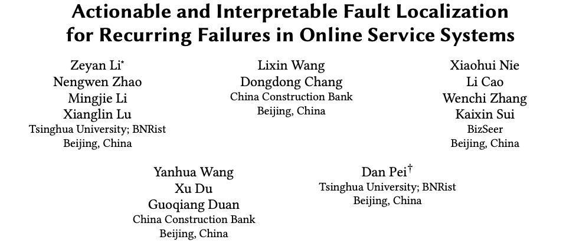
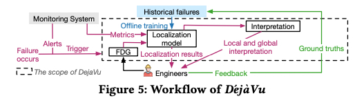
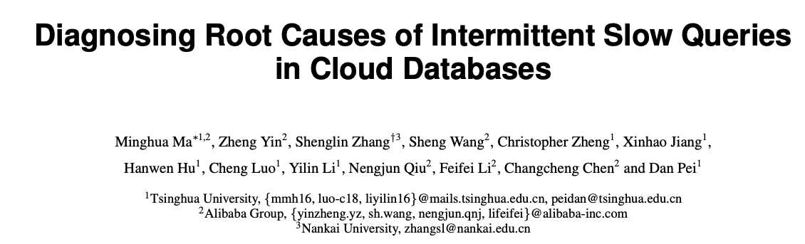
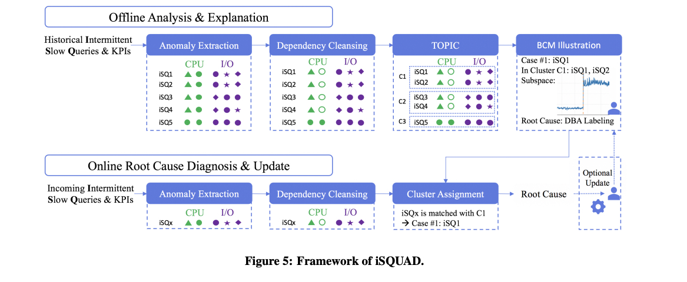
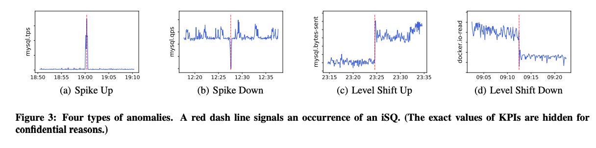
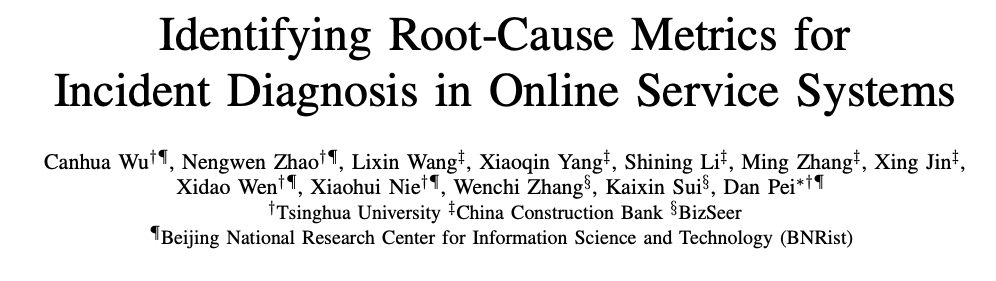
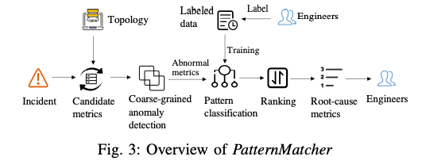
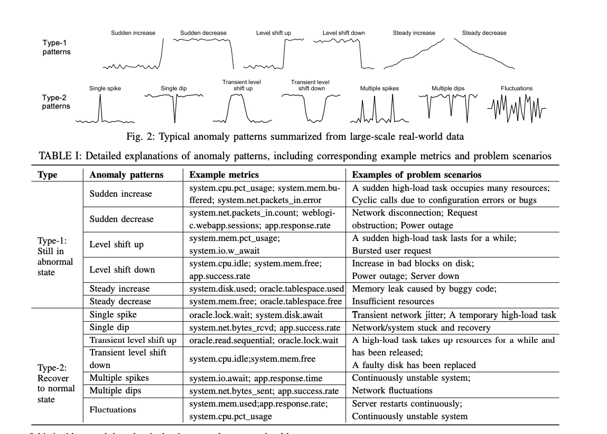

故障刻画是指通过提取历史的故障发生时不同 Metric 变化的特征，挖掘出不同种类故障发生时 Metric 变化的特征集合。在运行时阶段，可通过匹配特征集合定位到具体的故障种类。

例如：CPU 竞争的故障的指标变化特征是 {"CPU 利用率升高", "响应延迟升高"}。那么当在线程序出现  {"CPU 利用率升高", "响应延迟升高"} 的情况时可推断为 CPU 竞争的故障。

## 
 <u>01</u>

### 
22_FSE_Actionable and Interpretable Fault Localization for Recurring Failures in Online Service System

**论文简介:** Dejavu 是一种通过对故障进行刻画找到每种故障对应的特征，从而在故障重复发生时快速进行根因定位的方法。Dejavu 利用基于 gated recurrent unit (GRU) recurrent neural networks 构建的特征提取器统一表达故障故障单元（failure class）。然后根据 Trace 和 CMDB 构建的 failure dependency graph（FDG）。接着基于 graph attention networks (GAT) 算法对 FDG 图上的每个故障单元计算聚合的特征。最后在基于 dense neural network 为每个故障单元计算出故障的得分，得分最高的为根因故障。此外，Dejavu 还提供了故障的可解释算法用于向 SRE 解释故障的根因。

**个人评论：** 论文是清华大学裴丹老师团队在 CCF A类会议 FSE 上发表。论文主要针对故障重复发生的场景，需要大量的标签，且无法很好地处理新的故障。

> 论文链接：[https://arxiv.org/abs/2207.09021](https://arxiv.org/abs/2207.09021https://arxiv.org/abs/2207.09021)
> 代码链接：[https://github.com/NetManAIOps/DejaVu](https://github.com/NetManAIOps/DejaVu)

## 
 <u>02</u>

### 
20_VLDB_Diagnosing Root Causes of Intermittent Slow Queries in Cloud Databases

**论文简介:** MicroRCA 首先构建一个包含服务调用路径对应主机的属性图。在异常发生时，MicroRCA 通过判断服务之间的边的响应延迟是否异常提取异常子图。然后通过对子图进行加权计算连接节点之间的相似度，接着使用异常服务节点的响应时间与其容器资源利用率之间的最大相关系数来调整服务异常的分数，最后使用 PageRank 算法进行定位根因。

论文定义了四种值得参考的异常类型

**个人评论：**  MSRA 马明华博士在阿里巴巴李飞飞博士团队访问时发表在 CCF A类会议 VLDB 上的论文。文章是一篇优秀的故障刻画文章。创新性的提出利用指标的类型来增加更多的线索，方法也可以用于指标的压缩。但是要获得 Level Shift Up 的类型需要长时间的数据采集，不能实现及时的根因定位。

> 论文链接：[http://www.vldb.org/pvldb/vol13/p1176-ma.pdf](http://www.vldb.org/pvldb/vol13/p1176-ma.pdf)
> 
> 代码链接：[https://github.com/NetManAIOps/DejaVu/blob/master/iSQUAD/iSQ.py](https://github.com/NetManAIOps/DejaVu/blob/master/iSQUAD/iSQ.py)

## 
 <u>03</u>

### 
21_ISSRE_Identifying Root-Cause Metrics for Incident Diagnosis in Online Service Systems

**论文简介:** 论文从大规模的生产系统中总结出 13 种典型的异常模式。然后提出了一个有监督的根因定位算法 PatternMatcher. PatternMatcher采用双样本假设检验作为粗粒度的异常检测算法，筛选出在该事件发生时表现正常的指标，从而大大减少搜索空间。之后，利用主动学习对历史故障进行标签，训练出一种基于一维CNN的异常模式分类方法，过滤掉那些工程师不关心的异常模式。最后利用 p-value 方法对每个指标计算得分并排序。

 

论文中总结的典型的指标异常模式：

 

**个人评论：** 论文是清华大学裴丹老师团队的论文，论文总结出的典型的指标异常模式是很值得学习的。

> 论文链接：[http://netman.aiops.org/wp-content/uploads/2021/10/wch_ISSRE-1.pdf](http://netman.aiops.org/wp-content/uploads/2021/10/wch_ISSRE-1.pdf)

CloudWeekly 每周分享与云计算相关论文，相关的论文集被收纳到 github 仓库 https://github.com/IntelligentDDS/awesome-papers