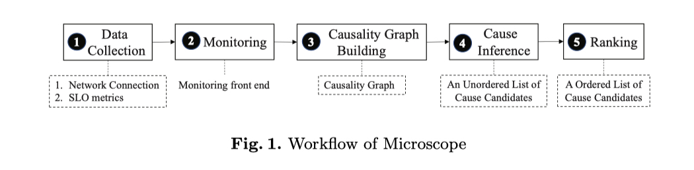
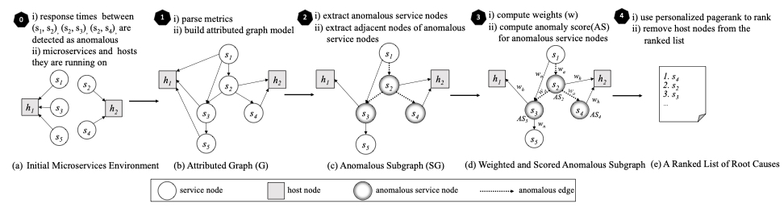
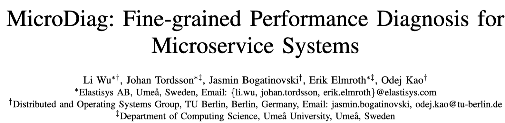
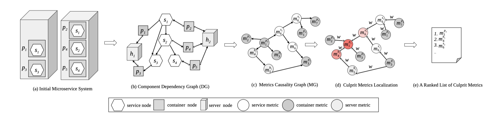
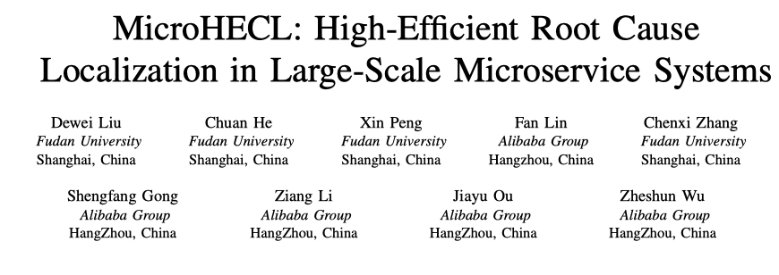
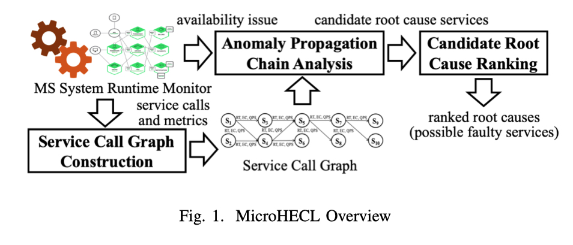

上篇文章[基于 Metrics 的根因定位 (一)：故障刻画](https://yuxiaoba.github.io/post/metric_based_rca_1/) 介绍了使用故障刻画思想定位根因的几种算法。除故障刻画外，还有另外一种根因定位的思想是通过 Metrics 之间的依赖关系构建出因果关系图，然后基于相关性或随机游走算法在图上游走从而定位出根因。下面简要介绍典型的几个 Micro.X 算法。

## 
 01

### 
18_ICSOC_Microscope: Pinpoint the Abnormal Services with Causal Graphs in Micro-service Environments

**论文简介:** 在不进行源代码进行插桩的情况下，Microscope 通过拦截网络连接信息和指标之间的相关性构建出微服务之间的因果关系图。在根因定位被触发时，Microscope 从前端对因果关系图进行遍历，找到因果关系图每个分支中最深的 SLO 异常服务并判定为根因候选。最后计算根因候选与前端服务的相关性为每个根因候选赋予得分。

**个人评论：** 论文是我导师来了中大以后组内的第一篇论文,发布在 CCF B 类会议 ICSOC 上。第一作者的师兄去了外交部，现在在非洲为国奋斗。论文的主要贡献放在因果关系图的构建，根因的推断是比较简单的深度优先搜索和根节点的相关性计算。

> 论文链接：[https://link.springer.com/chapter/10.1007/978-3-030-03596-9_1](https://link.springer.com/chapter/10.1007/978-3-030-03596-9_1)

## 
 02

### 
20_MicroRCA: Root Cause Localization of Performance Issues in Microservices

**论文简介:** MicroRCA 首先构建一个包含服务调用路径对应主机的属性图。在异常发生时，MicroRCA 通过判断服务之间的边的响应延迟是否异常提取异常子图。然后通过对子图进行加权计算连接节点之间的相似度，接着使用异常服务节点的响应时间与其容器资源利用率之间的最大相关系数来调整服务异常的分数，最后使用 PageRank 算法进行定位根因。

**个人评论：** 论文通过构建因果关系图，然后通过对图上的节点和边赋予权重进行 PageRank 计算，是一个通用的根因定位思路。

> 论文链接：[https://hal.inria.fr/hal-02441640/document](https://hal.inria.fr/hal-02441640/document)
> 
> 代码链接：[https://github.com/elastisys/MicroRCA](https://github.com/elastisys/MicroRCA)

## 
 03

### 
21_MicroDiag: Fine-grained Performance Diagnosis for Microservice Systems

**论文简介:** MicroDiag 首先构建不同指标类型之间的异常传播依赖关系：
- 对资源类指标（如 CPU）传播, MicroDiag 采用 SCM（Structural Causal Model）推断异常的传播方向
- 对业务指标传播（如 Latency）MicroDiag 先用 Istio 获得服务依赖图，然后根据服务依赖图的逆向推断传播方向
- 通过资源类和业务类指标传播, MicroDiag 采用 Granger causality tests 推断异常的传播方向
  
接着 MicroDiag 通过皮尔逊相关系数计算指标间的相似性来判断异常传播的概率，在归一化权重后通过 PageRank 直接计算图中节点的重要性给出节点排序。

 

**个人评论：** 论文发表在 ICSE 2021 的 Workshop 上，对不同种类的资源采用不同的因果推断异常传播的方向值得学习。

> 论文链接：[https://hal.inria.fr/hal-03155797/document](https://hal.inria.fr/hal-03155797/document)

## 
 04

### 
21_MicroHECL: High-Efficient Root Cause Localization in Large-Scale Microservice Systems

**论文简介:**  MicroHECL 首先根据根据最近30分钟的服务调用关系构造出服务依赖图，然后通过划分三个异常类型，构建出异常的传播图，最后根据异常传播图找到最深的节点作为根因
- 对性能故障，MicroHECL 采用 OC-SVM（one class support vector machine）以响应延迟的特征作为输入，判断是否存在性能故障。如果存在性能故障，故障传播从下游传播到上游
- 对可靠性故障，MicroHECL 采用随机森林以请求错误率的特征作为输入，判断是否存在可靠性故障。如果存在可靠性故障，故障传播从下游传播到上游
- 流量异常故障，MicroHECL 采用3-sigma 规则检测 QPS 的波动，判断是否存在流量异常故障。如果存在流量异常故障，故障传播从上游传播到下游
  
最后论文还提出了一个异常传播图剪枝的策略提高分析效率

 

**个人评论：** 本文是复旦大学彭鑫老师团队与阿里巴巴合作的论文，论文发表在 ICSE 2021 的 Workshop 上，论文预先对不同种类的异常进行分类，然后根据不同的传播方向分别构造异常传播图的思路值得学习。论文在阿里巴巴的数据上上取得 top3 为 68% 的准确率。

> 论文链接：[https://arxiv.org/pdf/2103.01782.pdf](https://arxiv.org/pdf/2103.01782.pdf)

CloudWeekly 每周分享与云计算相关论文，相关的论文集被收纳到 github 仓库 https://github.com/IntelligentDDS/awesome-papers