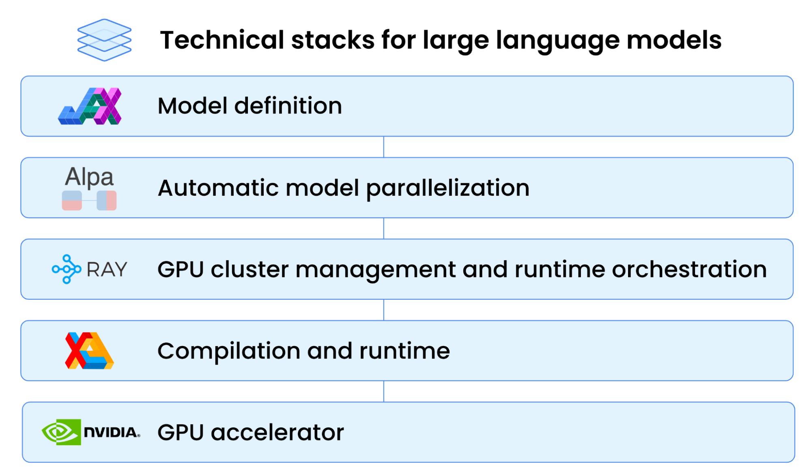
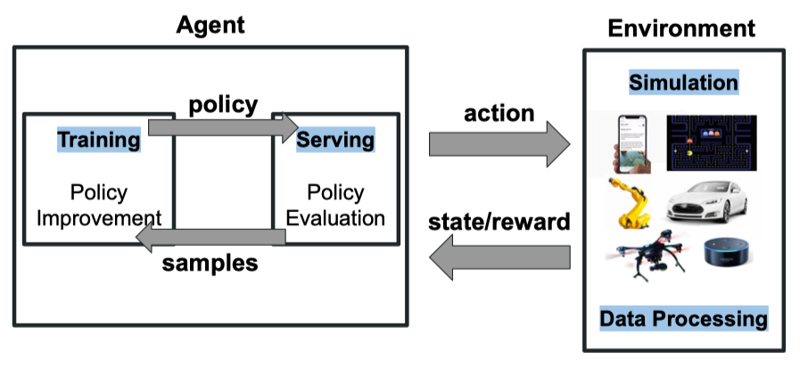
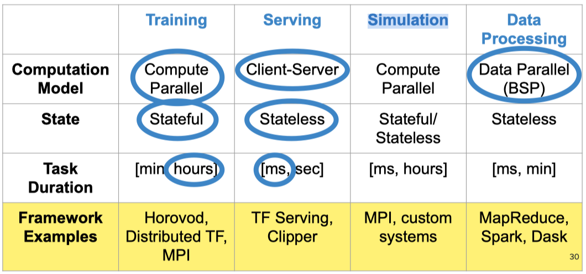
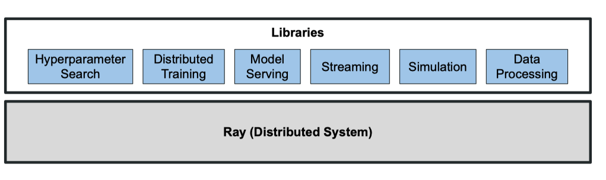
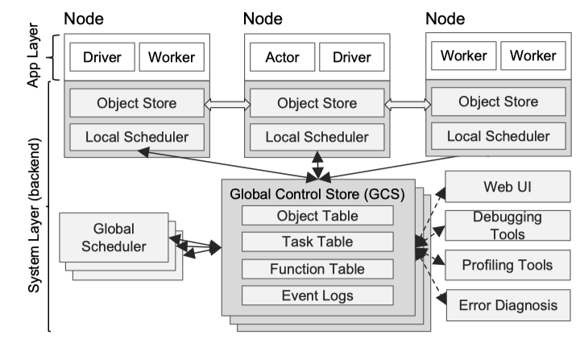
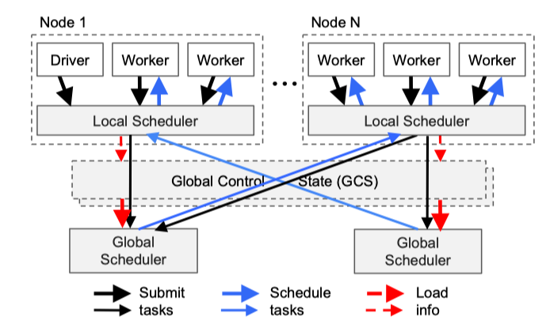
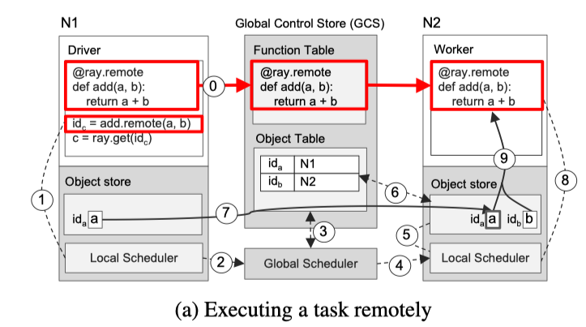
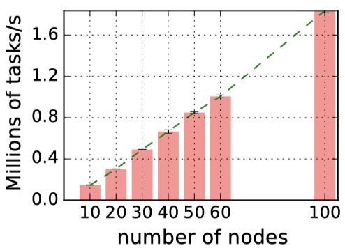
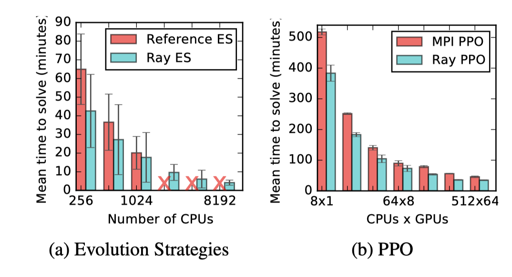

在上一次的推送 [ChatGPT 后面的分布式 AI 框架：Alpa](https://yuxiaoba.github.io/post/alpa/) 中，我们介绍了随着LLM 的发展，LLM 模型的参数已经超过了单个设备的 GPU 内存，为了能够高效地运行 LLM 的训练和推理任务，工程师可以使用 Alpa 对模型进行划分，然后将子任务调度到能够满足计算内存需求的 GPU 设备上进行计算。

那对模型进行划分以后，由什么框架来进行调度呢？与 Spark 和 Alpa 一母同胞，同样出自 UC Berkeley RiseLab 的 Ray 是当前一个热门的选择。Ray 是 2017 年 RiseLab 开源的通用的分布式调度框架，目前在  Github 上已经超过  2 W Star, 蚂蚁金服、OpenAI 等公司都使用它来调度机器学习任务。

今天我们分享的论文就是 Ray 的论文原型，2018  年 UC Berkeley Rise Lab 团队发表在 CCF A 类的操作系统顶级会议 OSDI 上的论文：Ray: A Distributed Framework for Emerging AI Applications。值得注意的是，论文是  2018  年的，经过几年的迭代，当前的最新的  Ray 版本与论文的原型存在部分差异，但核心思想是不变的。

### 
2018_OSDI_Ray: A Distributed Framework for Emerging AI Applications

#### **论文背景** 

现代 AI 应用，如强化学习，它已经不是由一种机器学习任务组成，而是会包含多种机器学习任务，比如 Data Processing、Training、Serving 和Simulation 等。

不同类型的任务对计算模型、状态和时延的需求不同，AI 工程师可能需要基于不同的框架去设计和执行任务，比如在 Training 时使用TensorFlow 框架, 在Simulation 时使用  MPI 框架。 

在这种情况下，AI 工程师不仅需要熟悉众多的框架，而且框架之间进行信息传递和交互也并非易事。 Ray 基于此痛点，提出了一个通用的机器学习任务调度框架，它能够适应和调度多种机器学习任务。

#### **Ray 框架*** 

Ray 采取一种新的可横向扩展的分布式结构。Ray 的结构由两部分组成：Application Layer 和 System Layer。Application Layer 实现 API 和计算模型，执行分布式计算任务。System Layer 负责任务调度和数据管理，来满足表现性能和容错的要求。

1.  **Application Layer**

Ray的 Application Layer 使用传统的 Driver-Worker 模式进行组织。

- Driver：运行用户程序的进程
- Worker：执行指定的 stateless task
- Actor：执行指定的 stateful actor
- Local Scheduler：本地调度器，两级调度策略的第一级
- Object store：本地存储器，用于存储task输入输出结果。它是一个基于内存的对象存储，同节点的 worker 可以通过 shared mem 机制来获取数据

2. **System  Layer**

- Global Control Store (GSC) 维护整个系统的状态，他的核心是 KV 存储和基于 KV 存储的订阅发布机制。系统所有的控制状态都存储在 GSC 中，这样系统其他组件可以是无状态的。这不仅简化了对容错的支持（出现错误时，组件可以从 GSC 中读取最近状态并重新启动），也使得其他组件可以横向扩展

- Global Scheduler: 全局调度器，两级调度策略的第二级

- Bottom-Up Distributed Scheduler:  如下图所示 Ray 调度时，首先 Driver 会提交 task 到 Local Scheduler，Local Scheduler 将 task 调度给 Local Worker，将完成不了的 task 提交到 Global Scheduler， Global Scheduler 会根据每个节点的资源和预期等待时间，决策任务的调度去向。预期的调度时间可以根据任务在队列中的时间，任务的网络IO耗时来决定。这些信息可以根据心跳机制来获取。

3. **Ray Shedule Example** 

下图展示了由 Driver 调用 add.remote(a，b) 触发的逐步操作，其中 a 和 b 分别存储在节点 N1 和 N2 上。
N1 的 Driver 将 add(a，b)提交给 Local Scheduler

    1. Local Scheduler 发现 b 不在  N1  上，将  add(a，b) 转发给 Global Scheduler
    2. Global Scheduler 在 GCS 中查找 add(a，b) 的自变量的位置
    3. Global Scheduler  决定在存储自变量 b 的节点 N2 上调度任务
    4. 节点 N2 处的 Local Scheduler  检查 Local Object Store 是否包含 add(a，b) 的自变量
    5. 节点 N2 处的 Local Scheduler 发现 Local Object Store 没有 objetc a，它在 GCS 中查找 a 的位置 
    6. N2 Local Scheduler  得知 a 存储在 N1，N2 的 Object Store 复制它到本地
    7. 由于add() 的所有参数现在都存储在 Local Object Store，所以Local Scheduler  在 Local Worker 调用 add()
    8. N2 Local Worker 通过共享内存访问参数并执行

#### **论文结果** 

Ray 中 GCS 的主要优势是增强系统的横向可扩展性。在实验中可以观察到几乎线性的任务吞吐量增长。在 60 节点，Ray 可以达到超过每秒 100 万个任务的吞吐量，并线性地在 100 个节点上超过每秒 180 万个任务。最右边的数据点显示，Ray 可以在不到一分钟的时间处理 1 亿个任务（54s）

论文用 Ray 实现了两种 RL 算法：Evolution Strategies (ES) 和 Proximal Policy Optimization(PPO)，然后与专为这两种算法设计的系统进行对比，Ray 可以赶上，甚至在更多的 GPU 下可以超越特定的系统。

Ray 是一个通用的分布式机器学习任务调度框架，Ray 通过将计算任务抽象为 Stateless  Task 和  Stateful Actor 支持了 Data Processing、Training、Serving 和Simulation 多种不同的机器学习任务类型。

Ray 通过全局存储机制，自底向上的两段式调度来实现 Stateless  Task 和  Stateful Actor 的执行计算。同时系统所有的控制状态都存储在 GSC 中，其他组件可以很方便地进行扩展，并且在设计中考虑了容错和低延时。

> 论文链接：[https://www.usenix.org/system/files/osdi18-moritz.pdf](https://www.usenix.org/system/files/osdi18-moritz.pdf)
> 代码链接：[https://github.com/ray-project/ray](https://github.com/ray-project/ray)

CloudWeekly 每周分享与云计算相关论文，相关的论文集被收纳到 github 仓库 [https://github.com/IntelligentDDS/awesome-papers](https://github.com/IntelligentDDS/awesome-papers)