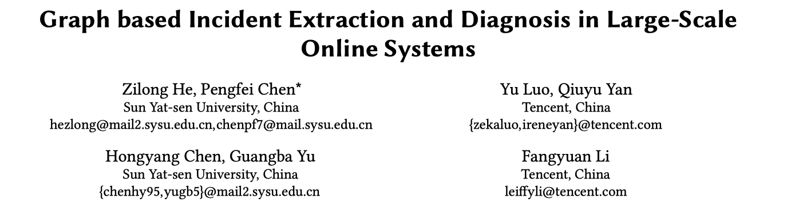
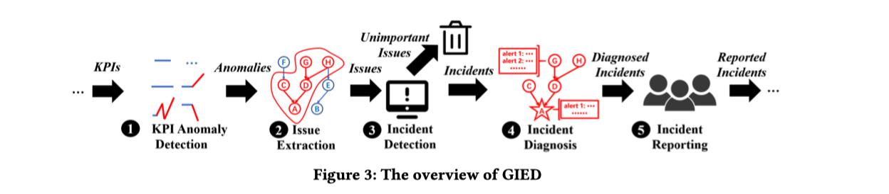
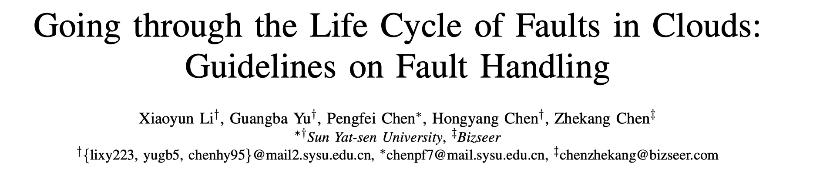
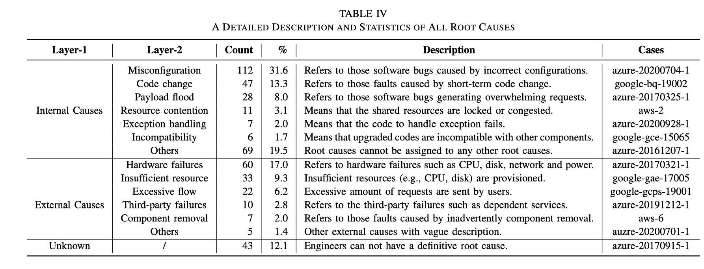
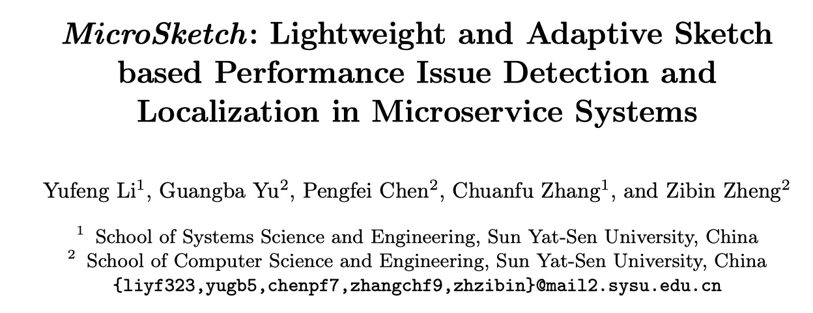
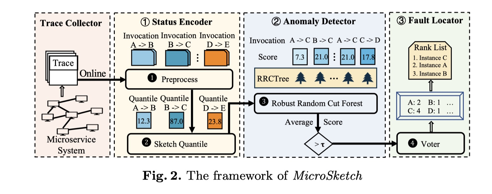
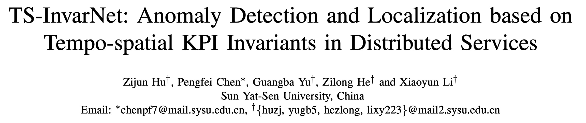
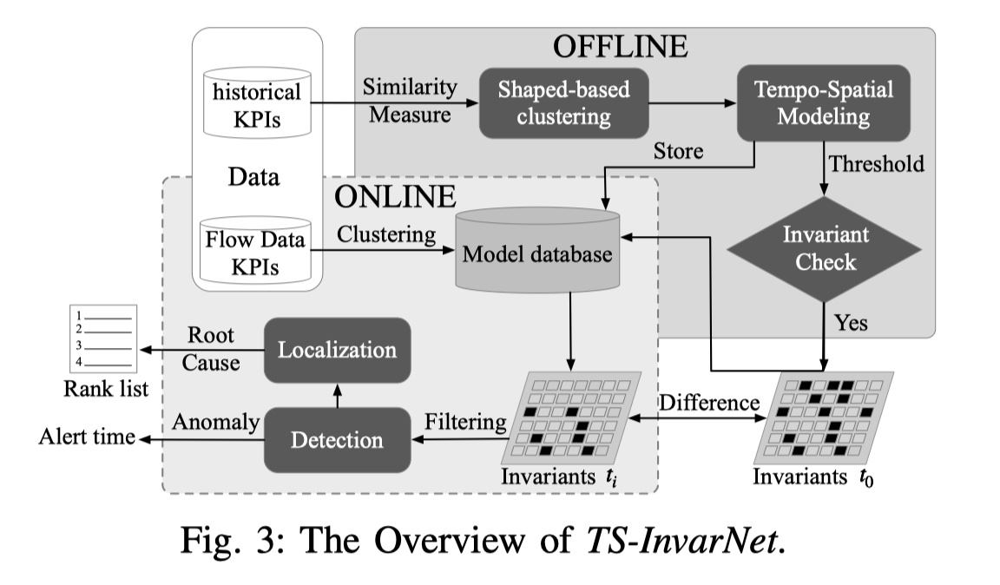
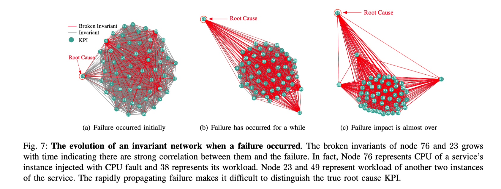

实验室最近在 ASE2022，ISSRE2022, ICSOC2022, ICWS2022 等会议上，都有斩获，下面简单的分享一下我们的工作。

## 
 01

### 
22_ASE_Graph based Incident Extraction and Diagnosis in Large-Scale Online Systems

**论文简介:** 在大规模微服务系统中，一个可用性的故障可能会因级联效应导致多个上游服务发生异常，这导致难以定位出真正的根因。为了解决这个问题，本文首先将 KPI 与前一天的 KPI 值进行对比对 KPI 进行异常检测，并基于 DBSCAN 和链路图抽取出与被故障影响的异常子图。接着将异常子图及其节点的特征输入到图神经网络中判断是否异常。如果异常，则在此异常子图上利用 Pagerank 定位出根因。

**个人评论：** 论文发表在 CCF A 类会议 ASE 2022 上，论文比较详细地介绍了当前微信内部基于指标和服务依赖图的根因定位算法，久经考验，非常值得落地学习。

> 论文链接：[https://yuxiaoba.github.io/publication/gied22/gied22.pdf](https://yuxiaoba.github.io/publication/gied22/gied22.pdf)
> 
> 代码链接：[https://github.com/IntelligentDDS/GIED](https://github.com/IntelligentDDS/GIED)

## 
 02

### 
22_ISSRE_Going through the Life Cycle of Faults in Clouds:Guidelines on Fault Handling

**论文简介:** 即便是当前最先进的云平台，小范围的可用性故障依旧是层出不穷。云厂商在故障发生后，通常会公开自己对故障的事后分析来给用户一个解释。在本文中，我们收集并格式化了 354 个来自 AWS，Azure，Google 公开的故障的事后调查（incident）。在此数据集之上，我们从故障的生命周期：故障发生，故障检测，故障定位，故障修复四个方面对这些 incident 进行了定量和定性的研究，并获得了 10 个重要的发现。最后我们还基于这些发现指导当前云计算平台的智能运维，混沌工程和可观测性的研究。

**个人评论：** 论文发表在 CCF B 类会议 ISSRE 2022 上，采集这 300 多个 incident 的经历真的不堪回首，甚至还为我在微信实习的第一个工作打下了基础。在 rebuttal 的时候还出了突发情况，还好最后被录用了，不用再继续更新数据集了。当时我在读 Google SRE 书的时候突然想引用了几个名人名言，还挺有意思的。

> 论文链接：[https://yuxiaoba.github.io/publication/swisslog22/swisslog22.pdf](https://yuxiaoba.github.io/publication/swisslog22/swisslog22.pdf)
> 
> 代码链接：[https://github.com/IntelligentDDS/SwissLog](https://github.com/IntelligentDDS/SwissLog)

## 
 03

### 
22_ICSOC_MicroSketch: Lightweight and Adaptive Sketch based Performance Issue Detection and Localization in Microservice Systems

**论文简介:** Trace 是可观测性的重要组成部分，但是基于 Trace 的异常检测和根因定位算法一直受制于对每条 Trace 分析带来的巨大开销。本文借鉴了网络通信中常用的 Sketch 的思想，首先基于 Sketch 计算出每个调用对的百分位数延迟，然后所有调用对的延迟输入到随机砍伐森林 (Robust Random Cut Forest) 中检测出异常的调用对，最后根据投票机制定位出根因。

 

**个人评论：** 论文发表在 CCF B 类会议 ICSOC 2022 上，考虑到大规模的生产系统上遍历分析每一条 Trace 的成本，把 Trace 指标化是当前工业界利用 Trace 进行分析的主要方式。本文提出了基于 Sketch 的轻量级 Trace 指标化方案，与遍历每条 Trace 进行分析的 Microrank 相比，速度提升明显。

> 论文链接：[https://yuxiaoba.github.io/publication/microsketch22/microsketch22.pdf](https://yuxiaoba.github.io/publication/microsketch22/microsketch22.pdf)

## 
 04

### 
22_ICWS_TS-InvarNet: Anomaly Detection and Localization based on Tempo-spatial KPI Invariants in Distributed Services

**论文简介:** 在大规模的分布式系统正常运行中，某两个 KPI 之间可能存在某种稳定的关系。例如，上下游服务因流量的一致性可能 CPU 利用率的变化存在相似的变化关系。我们把这种稳定的关系称为不变量。本文致力于在系统正常运行阶段挖掘出不同 KPI 之间的不变量关系，在系统发生故障后通过检测不变量是否被破坏来进行异常检测和根因定位。

 

**个人评论:** 当前的基于深度学习的异常检测算法通常可解释性比较差，我们提出的基于时空不变量的方法有较强的可解释性，易于工程师理解系统的变化。下图中展示了当故障发生时，不同节点的 KPI 之间不变量的变化的例子，非常容易理解。

 

> 论文链接：[https://yuxiaoba.github.io/publication/tsinvarnet22/tsInvarNet22.pdf](https://yuxiaoba.github.io/publication/tsinvarnet22/tsInvarNet22.pdf)

CloudWeekly 每周分享与云计算相关论文，相关的论文集被收纳到 github 仓库 https://github.com/IntelligentDDS/awesome-papers