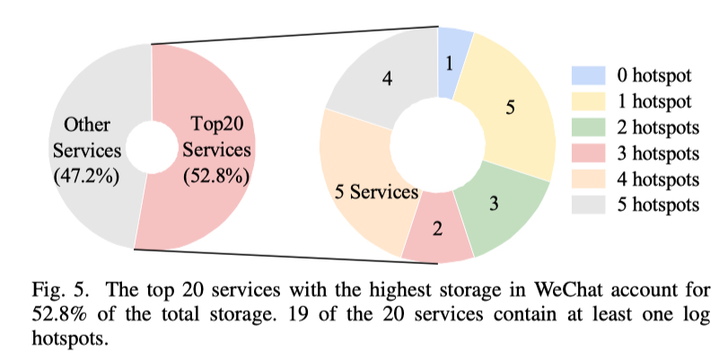
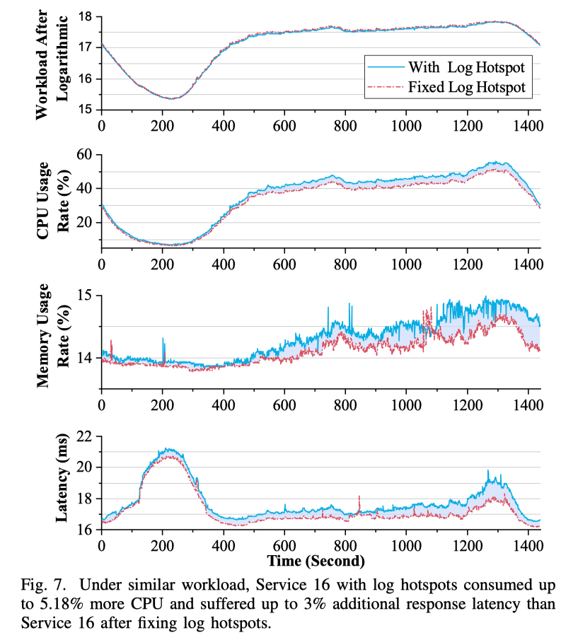
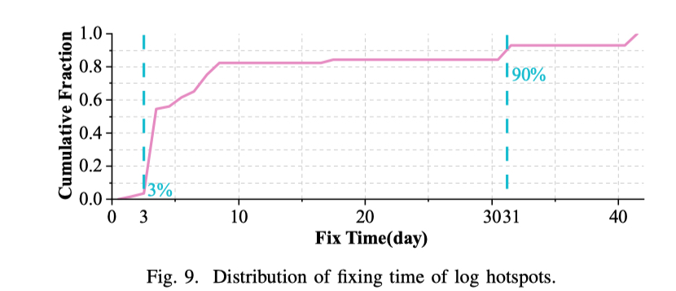
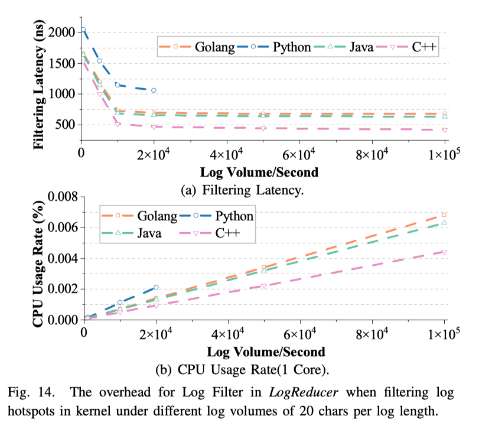
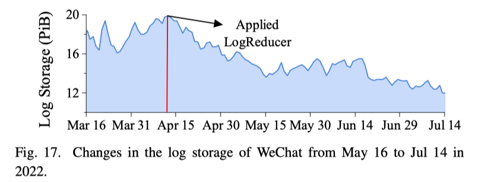

今日冬至，天时人事日相催，冬至阳生春又来。

2022 年 5 月我入选了 2022 腾讯犀牛鸟精英人才计划，来到微信的技术架构部的质量平台组做科研实习生。在降本增效的大背景下，我到微信的第一个研究工作是降低海量日志打印和存储的开销。
基于该研究的论文 “ LogReducer: Identify and Reduce Log Hotspots in Kernel on the Fly ” 被软件工程领域顶级国际会议 ICSE 2023 的 Technical Track 录用。论文作者包括中山大学的余广坝、陈鹏飞，腾讯的李派锐、翁天俊、郑海兵，邓月堂。

## 
 1. 研究问题

为了协助工程师及时地发现和诊断软件运行时的发生的故障，工程师通常会在程序代码中插入日志语句打印软件运行时的状态。但是，虽然打印大量的运行时日志对定位和解决故障很有帮助，但是日志打印不仅会影响到软件运行的性能，而且造成了很大的持久化负担。在微信，每天的后台日志打印接近 100 万亿行，占用了接近 20 PB 的存储，带来了巨大的运营成本。

为了削减日志的运营成本，我们对微信后台的日志打印和存储的特征进行了分析和挖掘，我们发现「绝大多数的日志开销是由少数的几条日志语句导致的」，我们将这些日志语句称为「日志热点」。这个发现启发我们：「及时发现日志热点，对日志热点的打印进行优化即可降低大量的日志开销」。
例如，微信某个服务的占用存储 Top1 的日志模板占用了该服务 95.7% 的存储，而其他200多个日志模板只占用了剩余 4.3% 的存储，因此如果我们能把 Top1 的这条日志进行优化（如采样或者合并打印）就可以降低大量的开销。

但是，即便是我们通过分析存储发现了日志热点，想要对其进行及时的处理也不容易。在运营工程师发现某个服务的日志热点并告警给服务对应的开发工程师时，考虑到服务更新上线的计划，开发工程师一般不会立即对日志热点进行优化并上线，通常是等待到服务的下一次更新才进行上线。即便是程序上线后，灰度发布的过程也可能会持续几个小时甚至几天才能更新完服务的所有实例。在这期间，日志热点还是会持续影响程序。
因此我们必须能够在程序运行时对日志热点进行优化。「我们需要一个能够在运行时对日志打印进行针对性拦截和优化的工具，用于缓解发现日志热点到服务上线完成期间的日志开销」。

## 
 2. 日志热点的实证研究

为了更好地理解日志热点，我们首先对微信的日志热点做了一些实证研究。

### 日志热点定义

首先我们对日志热点进行定义：假设一个服务 A 在一个时间窗口内占用了S GB 存储， 它包含 n 个日志模板:log1,log2,...,logn, 这些日志模板分别占据了S1,S2,....,Sn GB 的存储 (其中S =S1+S2+...+Sn)，那么日志热点可以定义为：

Si/S>ξ,

这里的 ξ 由工程师制定，我们默认为 0.05。

### 日志热点的普遍性

我们选取了微信后台日志中存储占用前 20 的服务，对其日志存储进行分析，我们发现日志存储占用前 20 的服务占用了超过 50 % 的存储空间，而其他剩余的 20000 多个服务才占用了 47.2% 的存储空间。

我们对上述20个服务的所有日志模板进行逐一的分析，我们发现其中有 19个服务至少包含一个日志热点。日志热点的存储总和平均占对应服务存储的 57.86%。

> 日志热点在不同的服务中普遍存在。对日志热点进行优化是一个性价比很高的日志约简操作。

### 日志热点对应用性能的影响

为了分析日志热点对性能的影响，我们对只更新了优化日志热点代码的服务的前后版本性能表现进行对比，我们发现，在相似的工作负载情况下，存在日志热点的版本要比不存在日志热点的版本多消耗 5% 的 CPU （58个核心） 和额外增加 3% 的延迟 （1.8ms）。

> 日志热点打印会造成额外的资源消耗（例如，CPU、内存）和性能下降。优化日志热点打印不仅减少了应用程序的资源消耗，还能提高了其性能。

### 日志热点修复的时长

当我们将日志热点告警给开发工程师后，我们持续跟踪日志打印和工程师优化上线的情况，对日志热点出现到被优化的时间进行了统计。我们发现 97% 的日志热点都是在告警3天以后才得到优化，平均需要超过 9 天。

同时我们还发现，日志热点的优化并不是一次性的工作，随着程序的迭代，新的日志热点会持续的出现。我们持续观察这 19 个服务三个月，发现 18个服务在优化后再次出现了热点日志。

> 日志热点优化通常不能得到及时的响应，且服务会反复出现日志热点。在生产环境中自动检测和运行时动态地修复日志热点是非常重要的。

此外我们还对日志热点出现的原因和修复方式进行了调研，详细内容可以看我们的论文。

## 
 3. LogReducer 日志约简框架

对微信这种体量的用户，想要设计一个高效的能够在生产环境中自动检测和运行时动态地修复日志热点的工具是很有挑战的：
- 「海量的日志规模」：每天需处理上百亿行日志，框架处理日志必须足够高效
- 「不影响程序开发」：框架对开发工程师是无感知的，不需对原有代码进行修改或者重编译
- 「支持多种编程语言」：框架应该能够支持对多种编程语言的日志打印进行优化
- 「不影响服务运行」：框架的执行应该不影响服务的正常运行，不能重启或中断服务
  
传统的日志压缩方法虽然可以缓解日志存储的压力，但是无法消除日志打印对运行时的影响以及日志发送到数据库的开销。在 log agent（例如：filebeat, promtail）中对热点日志进行过滤也是一种解决方式，但是它同样无法消除日志打印对运行时的影响，而且过滤的效率较低。
为了更好的解决上面的挑战，我们提出了一个「基于 eBPF 的日志约简框架：LogReducer」，框架图如下图所示：

LogReducer 的运行工作流如下所示：

① LogParser 周期性地从日志数据库中拉取数据，然后基于日志框架中打印的代码位置解析出日志模板，并统计出每个日志模板对应的存储消耗。

② Hotspot Classifier 根据日志热点定义的公式判定是否存在日志热点。

③ 如果存在日志热点，Hotspot Classifier 会将日志热点的模板及存储占用信息分别告警离线阶段的程序员和在线阶段的 Log Filter 中。程序员在收到告警后，会根据经验对日志热点进行修复和重新发布。

④ 在在线阶段，在用户态的 Python Log Filter 会根据告警的日志模板信息，将模板信息 load 进 eBPF Maps 中。在内核态的 eBPF Log Filter 会实时拦截和解析应用程序调用系统调用 Write() 写日志的操作，并在内核态将写入的日志与 eBPF maps 中的日志模板进行匹配，如果匹配成功，则将该次写入丢弃，提前返回日志写入操作，避免日志的用户态和内核态切换，也避免了实际的写入操作。

## 
 4. 实验评估

为了评估我们提出的框架，在在线阶段，我们用四种不同的编程语言写了四个日志打印的 benchmark，然后通过控制每秒打印的日志数目测试 LogReducer 的消耗。从下图可以看出，LogReducer 在每个服务实例每秒打印 10 万条日志的时候，也只会给「每个请求增加 500 纳秒」 (一纳秒等于一秒的十亿分之一)的延迟，消耗的 CPU 资源也不到单核的万分之一。

在离线阶段，我们将告警转发到企业微信并自动拉群，将日志热点的信息转发给服务对应的开发工程师，由开发工程师对日志进行优化。离线阶段的方法在微信实际落地后，将微信每日日志存储量从「20 PB 降低到 12 PB （每日日志存储量降低了40%，每年节省上千万人民币)」。

以上就是论文的主要内容了，因为最近有点忙，camera-ready 的论文我还没有准备后，后面准备好我会尽快将论文上传到我的个人主页（https://yuxiaoba.github.io）和 Github 的仓库（https://github.com/IntelligentDDS/awesome-papers），欢迎关注我们的工作！。

最后，非常感谢微信的 Perry, Matt 哥，Tang 哥，还有参与 emparical study 的各位大佬们对论文的支持。第一次离开实验室，来到工业界下山游历，做的还是自己不太擅长的日志分析，说实话是有点慌的，还好一路得到好多人的帮助，也希望后面还会有其他的产出。

2022 年只剩下 10 天了，本文应该是 2022 年我们的最后一篇推送，感谢大家对我们实验室工作的关注。特殊时期，愿大家各自保重，祝各位身体安康，一起迎接 2023 年的到来！

CloudWeekly 每周分享与云计算相关论文，相关的论文集被收纳到 github 仓库 [https://github.com/IntelligentDDS/awesome-papers](https://github.com/IntelligentDDS/awesome-papers)