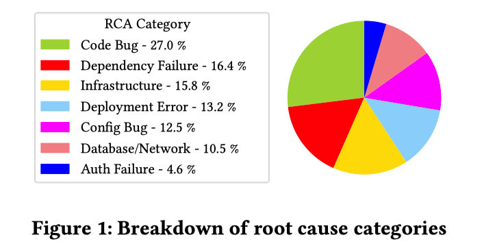
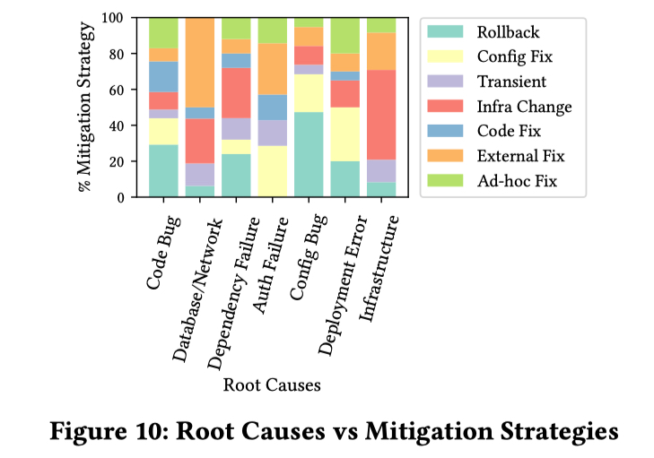
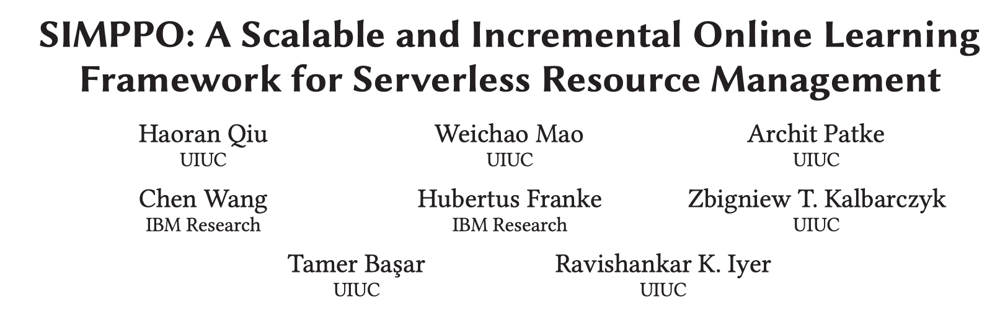
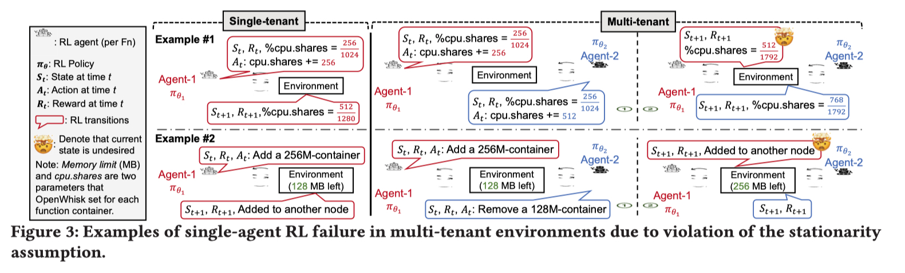
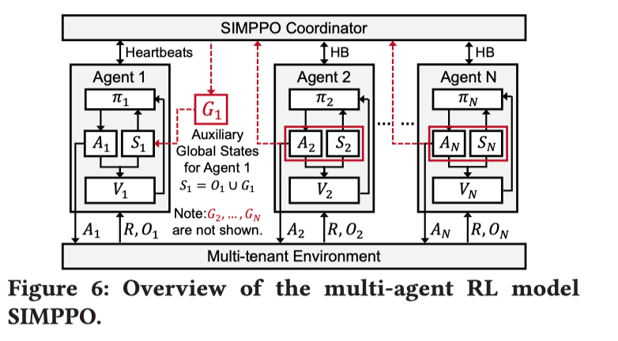
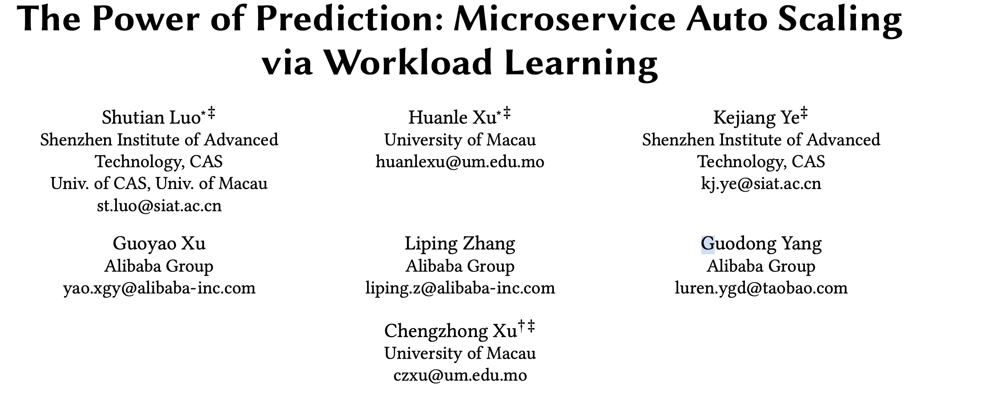
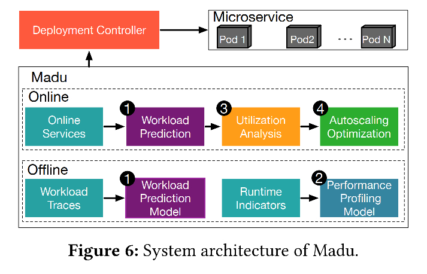

今日小雪，枫叶欲残看愈好，梅花未动意先香。记得加衣服了～

ACM Symposium on Cloud Computing 是 Cloud Computing 领域顶级的会议。SoCC 虽然是一个 CCF B 会议，但它是我最喜欢的计算机会议，而且我觉得 SoCC 与 Eurosys 的 Paper 都是有 A 类会议实力的。

SoCC 2022 上周在旧金山举行，会议共收到 155 份投稿，录用了 38 篇，录用率 24.5% 。作为 SoCC 的忠实粉丝，当然我也投了，当然我也是分母。不过今天还是想要分享和推荐 SoCC 2022 上我很感兴趣的部分论文。

## 
 01

### 
22_SoCC_How to Fight Production Incidents? An Empirical Study on a Large-scale Cloud Service

**论文简介:**  论文从 incident 的生命周期（即 root cause、detection、mitigation ）的角度分析了 Microsoft Team 从 2021 年 5 月到 2022 年 5 月发生的 152 个较为严重的 incident，并对每个阶段之间的相关性进行了详细的分析。回答了以下四个问题：

- 为什么会发生这些 Incident

- 如何修复这些 Incident ?

- 什么原因导致检测和修复 Incident 需要较长延迟？

- 什么样的自动化可以帮助服务恢复可用性?

**个人评论：** 论文是来自 Microsoft ，获得了今年 SoCC 的 Best paper ! 在 [DDS 第一手研究曝光（一）](https://yuxiaoba.github.io/post/recent_paper1/) 介绍了今年我们在 ISSRE 2022 的分析 Incident 的论文，无独有偶，论文角度几乎一致，但本文作者在企业内部，有更详细的数据，能分析的细节更多。

> 论文链接：[https://dl.acm.org/doi/10.1145/3542929.3563482](https://dl.acm.org/doi/10.1145/3542929.3563482)

## 
 02

### 
22_SoCC_SIMPPO: A Scalable and Incremental Online Learning Framework for Serverless Resource Management

**论文简介:** Serverless FaaS 被誉为下一代的云计算范式，它提供了尽可能小粒度的资源分配和极致的弹性。但如此细粒度的情况下，在保持高资源利用率的同时管理资源以满足SLO的问题是一个 NP-hard 的问题。论文首先讨论了基于 Single-agent RL 的框架无法感知函数之间的动态资源竞争，会导致延迟不稳定从而违背 SLO。

因此， SIMPPO 采用了 Multi-agent RL 框架，它为每个函数配置了一个 Agent 以获得 FaaS 函数的最优资源配置（CPU Limit, Memory Limit, Number Limit）。在训练阶段， SIMPPO 的核心思想是将其他函数和环境的 Multi-agent 视为一个 “Virtual Agent"，将 Multi-agent 转化成为了一个 Two agent 的问题，从而大大加快了强化学习模型收敛的速度。

 

**个人评论：** 论文是来自 UIUC 的 Qiu Haoran 博士，也是之前 OSDI 2020 的微服务自动伸缩 FIRM 的作者，也是我的直接竞争者，跟 UIUC 的大佬在这么小的方向撞车真的太难受了。论文在为函数训练模型时是没有考虑函数的参数的，应该来说比较难适应参数变化的问题，也没有考虑函数链的情况。论文还采用了一种两段式的论文写作方式，推荐可以去看看学习学习。

> 论文链接：[https://haoran-qiu.com/pdf/socc22.pdf](https://haoran-qiu.com/pdf/socc22.pdf)

## 
 03

### 
22_SoCC_The Power of Prediction: Microservice Auto Scaling via Workload Learning

**论文简介:** 论文首先基于两个观察：1）单个微服务的 Workload 存在较大的不确定性；2）每个 Container 的 Workload 与 OS-level metrics 存在很强的相关性，提出为每个微服务训练一个自动伸缩的模型来满足 SLO。在离线阶段，论文首先训练出一个融合了 Stochastic Attention 机制的 Seq2Seq 模型对 Workload 进行预测，然后基于  Linear Regression 学习出 CPU 和 Memory 跟 Workload 之间的关系。在线阶段，论文通过预测 Workload 找到可以满足 CPU 和 Memory 的最小服务实例数目，从而执行 Autoscale 。

 

**个人评论：** 论文是去年的 SoCC Best Paper 叶可江老师团队再一次与阿里巴巴合作的基于 Trace 的成果，每年都有一篇 SoCC 可太羡慕了。利用 Trace 精确为每个服务进行 Autoscale 是一直我想做的，思路也是一致的，叶老师做的太快了.

> 论文链接：[https://dl.acm.org/doi/abs/10.1145/3542929.3563477](https://dl.acm.org/doi/abs/10.1145/3542929.3563477)

CloudWeekly 每周分享与云计算相关论文，相关的论文集被收纳到 github 仓库 [https://github.com/IntelligentDDS/awesome-papers](https://github.com/IntelligentDDS/awesome-papers)