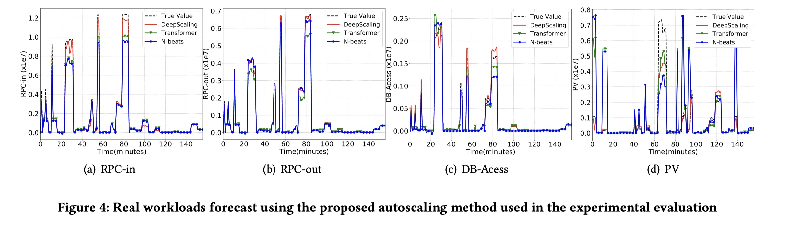
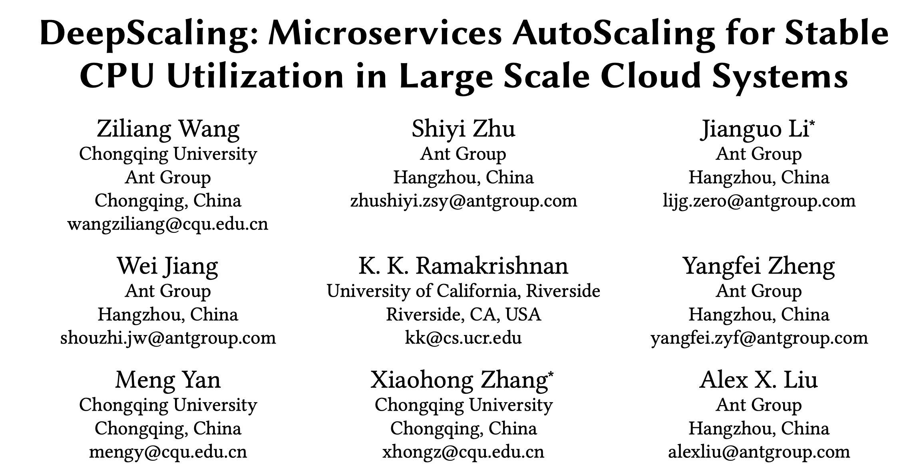
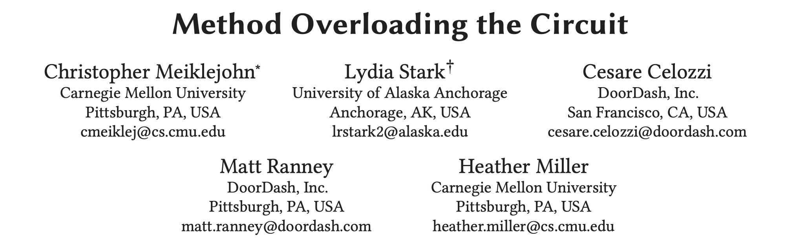
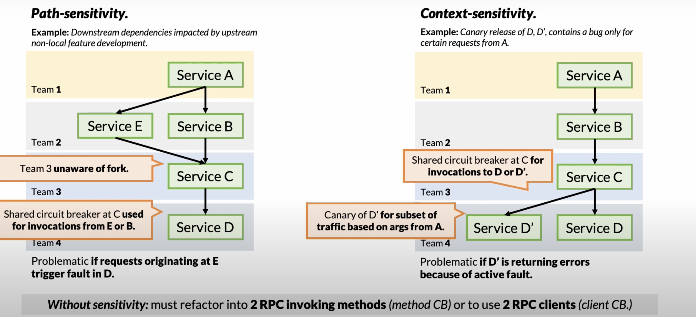

今日小寒，小寒纪节欣相遇，瑞兆占年定可期。

ACM Symposium on Cloud Computing 是 Cloud Computing 领域的顶级会议。SoCC 虽然是一个 CCF B 会议，但它是我最喜欢的计算机会议，而且我觉得 SoCC 的 Paper 是有 A 类会议实力的。很遗憾它这次没有像 Eurosys 一样增补为 A 类会议。

SoCC 2022 会议共收到 155 份投稿，录用了 38 篇，录用率 24.5% 。作为 SoCC 的忠实粉丝，当然我也投了，当然我也是分母。之前我分享和推荐了部分 SoCC 2022上我很感兴趣的论文 [SoCC 2022 论文集合（一）](https://yuxiaoba.github.io/post/socc_1/)，这一次我们继续介绍两篇 SoCC 2022 上的 Paper。

## 
 01

### 
22_SoCC_DeepScaling: Microservices AutoScaling for Stable CPU Utilization in Large Scale Cloud Systems

**论文简介:**  为了在保障服务 SLO 的前提下，使系统的 CPU 利用率最大化从而减少资源的消耗，蚂蚁金服提出了一个名为 DeepScaling 的微服务自动伸缩框架。DeepScaling 将微服务自动伸缩3个模块：流量预测模型（Workload Forecaster），CPU估计模型（CPU Utilization Estimator）以及容量决策模型（Scaling Decider）。

- DeepScaling使用 Spatio-temporal Graph Neural Network 预测每个微服务的 Workload
- DeepScaling通过使用 Deep Neural Network, 将工作负载强度（包括RPC请求、文件I/O、DB 访问、消息请求、HTTP请求，以及特定的辅助特征如实例数、服务ID、时间戳等）映射到估计的 CPU 利用率来估计 CPU 利用率
- DeepScaling 基于改进的 DQN 强化学习算法为每个服务生成自动缩放策略

**个人评论：** DeepScaling 与 [SoCC 2022 论文集合（一）](https://yuxiaoba.github.io/post/socc_1/) 中的叶可江老师的 paper 的思路是类似的。DeepScaling 在蚂蚁集团拥有135个微服务的真实生产环境中部署，平均每天可节省3 W多个CPU内核, 6W 多GB的内存。虽然 DeepScaling 被小范围应用，但是我个人感觉如果工作负载预测准了，后面应该无需加上这么复杂的服务实例决策方法，也没有必要使用黑盒的方法。

> 论文链接：[https://dl.acm.org/doi/pdf/10.1145/3542929.3563469](https://dl.acm.org/doi/pdf/10.1145/3542929.3563469)

## 
 02

### 
22_SoCC_Method Overloading the Circuit

**论文简介:** Circuit Breaker (中文被翻译成熔断或者断路器) 机制是应对雪崩效应的一种微服务容错机制。当链路的某个微服务出错不可用或者响应时间太长时，会进行服务的降级，进而熔断该节点微服务的调用，快速返回错误的响应信息。当检测到该节点微服务调用响应正常后，恢复调用链路。

论文研究了两个来自大型食品配送平台 DoorDash 的 Circuit Breaker 工业使用案例。论文发现，现有的 Circuit Breaker 设计不仅不足以容错，而且还发现了应用程序代码中的小变化会对 Circuit Breaker 的工作方式有很大的改变。为了解决这些缺陷，论文提出了两种新的  Circuit Breaker 设计：Path-sensitivity 和 Context-Sensitivity 的 Circuit Breaker，并设想了它们的实现方式。

**个人评论：** 论文的角度很新奇，从 Circuit Breaker 的角度出发，是之前很少学术论文考虑的，比起一些做烂的话题，这个也挺有意思的。这个 CMU 的作者 Christopher Meiklejohn 也是一个牛人，一边创业一边发 Paper, 着实羡慕。

> 论文链接：[https://dl.acm.org/doi/abs/10.1145/3542929.3563466](https://dl.acm.org/doi/abs/10.1145/3542929.3563466)

CloudWeekly 每周分享与云计算相关论文，相关的论文集被收纳到 github 仓库 [https://github.com/IntelligentDDS/awesome-papers](https://github.com/IntelligentDDS/awesome-papers)