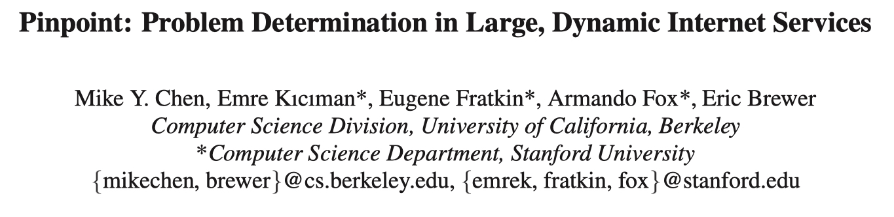
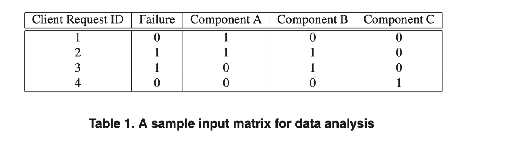
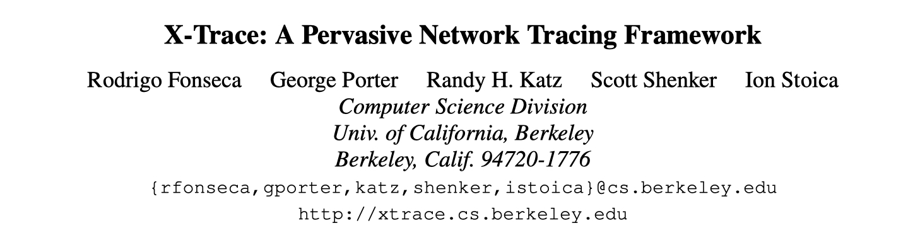
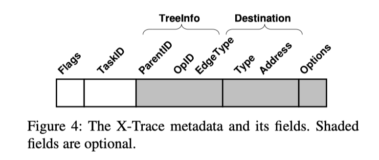
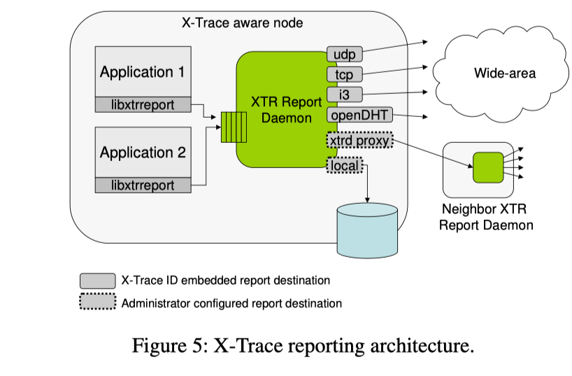
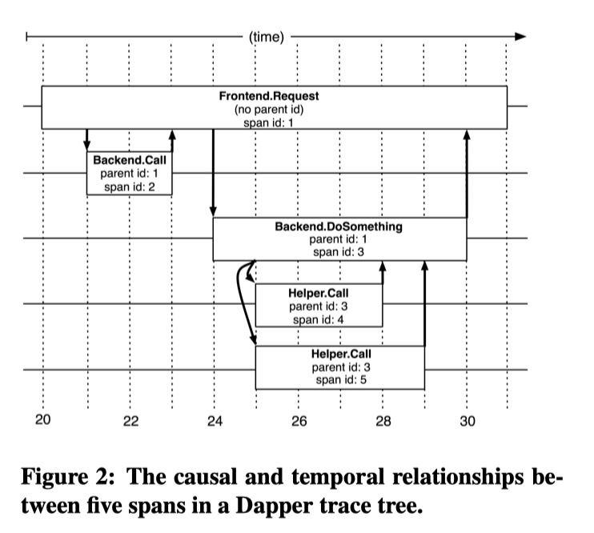

今日立冬，细雨生寒未有霜，庭前木叶半青黄。

Metrics, Traces, Logs 被誉为可观测性的三大支柱，先前我总结了基于 Metric 的三种根因定位方法：

- [基于 Metrics 的根因定位 (一)：故障刻画](https://yuxiaoba.github.io/post/metric_based_rca_1/)
- [基于 Metrics 的根因定位 (二)：因果关系图](https://yuxiaoba.github.io/post/metric_based_rca_2/) 
- [基于 Metrics 的根因定位 (三)：多维下钻](https://yuxiaoba.github.io/post/metric_based_rca_3/) 

接下来的几个月里，将继续不定期总结基于 Trace 的根因定位方法。Trace 追踪了请求在应用程序中运行的轨迹，能够完整的串联起请求的上下文关系，在大规模分布式系统根因定位中的作用举足轻重 。在讨论基于 Trace 的根因定位之前，本文先简单介绍 Trace 的出现及其演进的过程。

## 
 01

### 
02_DSN_Pinpoint: Problem Determination in Large, Dynamic Internet Services

**论文简介:** 典型的 Internet 服务有许多分为多个层的组件：Frontend、WebServer 和 Database，每个层中的许多（复制的）子组件。当客户端连接到这些服务时，它们的请求将通过该系统动态路由到子组件。为了捕获这些动态的请求路径，Pinpoint 设计了一种记录每个请求经过组件的数据格式，用于帮助工程师分析根因。

Pinpoint 为每个组件（Component）生成唯一的 Component ID 用于标记组件，为每个 HTTP 请求生成唯一的标识 Request ID 标记请求。在请求执行中 Request ID 通过线程局部变量（ThreadLocal）传递到下游组件，每次调用到一个组件，就使用 (Request ID , Component ID) 组合记录一个 Trace Log。除此之外，Pinpoint 还实时检测请求是否成功，并利用 Failure 字段对请求的成功和失败进行标记。 最后汇总 Trace Log 可获得下表所示的 Trace 数据。

**个人评论：** 论文发表于 2002 年的 CCF B 类会议 DSN，是我看到的第一篇生成唯一的 Request ID，并进行全链路传播的论文，为以后 Trace 的实现提供了思路。但在传统的三层架构的服务架构下，Span 之间的父子关系是比较简单的，论文还未考虑复杂的 Parent-Child Span 的构建。

> 论文链接：[https://ieeexplore.ieee.org/document/1029005](https://ieeexplore.ieee.org/document/1029005)

## 
 02

### 
07_NSDI_X-Trace: A Pervasive Network Tracing Framework

**论文简介:** 现代 Internet 系统通常结合不同的应用程序，并且跨越不同的网络管理域。为了构建在分布式集群的网络链路，X-Trace 论文延续并扩展了 Pinpoint 论文的思路，提出了能够重新构建完整 Trace 的框架。

X-Trace 的调用链追踪方案是对 Poinpont 思路的扩展，它将 Trace 的 Meta Data 写入到 message 中 (例如，写入到 HTTP 请求的拓展头上)，并沿着请求传播到经过的每个设备上。 与 Poinpont 相比，如下图所示 X-Trace 的 Meta Data 扩展了更多的元素，引入了 Span ID 和 Colletor 地址的概念。

 此外，X-Trace 还设计了一个Trace Collector 的框架，将 Trace 的生成与采集解耦。X-Trace 在本地启动一个开放一个 UDP 协议端口的守护进程，应用可以将 Trace 发送到守护进程，并放入到一个队列中，队列的另外一边则将 Trace 发送到缓存或者持久化的数据库中。

 

**个人评论：** X-Trace 发表于 2007 年的 CCF A 类会议 NSDI，论文对 Trace 的 Meta Data 的定义已经初具雏形，Trace Collector 的架构也深深地影响了现今的 Opentelemetry Collector, Jeager Agent 等 Trace Collector。但 X-Trace  还主要注重于 Trace 结构的构建，对时间的开销是忽视的，不能很好地诊断性能问题。

> 论文链接：[https://www.usenix.org/conference/nsdi-07/x-trace-pervasive-network-tracing-framework](https://www.usenix.org/conference/nsdi-07/x-trace-pervasive-network-tracing-framework)

## 
 03

### 
10_Google_Dapper, a Large-Scale Distributed Systems Tracing Infrastructure

**论文简介:** Google 网站一个 Web Search 请求可能需要上千台服务器和很多不同开发团队开发的服务去处理，为了帮助理解系统的表现和论证效率，Google 设计和开发了 Dapper 用于观测整个系统的行为。 Dapper 的设计理念与 Pinpoint、 X-Trace 有许多是相通的，Dapper 更注重于在工业应用中的低开销和应用的透明化。

由于 Google 内部的程序间的通信大多是通过 RPC 完成的，因此 Google 将 Dapper Trace 的预先插桩在 RPC 的框架内，预先定义所有 RPC 调用相关 Span，降低了 Trace 插桩的成本。下图展示了 Dapper Trace 的结构，Trace 由基本单元 Span 组成，一条 Trace 的所有 Span 共享唯一的可标识的 TraceID , 一个 Span 就是带有起止时间戳、RPC 耗时以及应用相关的 annotation。Parent Span 和 Child Span 通过 Parent ID 关联。引入 RPC 耗时将极大提升 Trace 用于根因定位潜力。

 

**个人评论：**  此外，为了达到低开销的设计目标，Dapper 还提出对 Trace 的采集进行采样。根据 Dapper 在谷歌的实践经验，对于许多常用的场景，即使对 1/1024 的请求进行采样收集，也能够得到足够的信息。

> 论文链接：[https://static.googleusercontent.com/media/research.google.com/zh-CN//archive/papers/dapper-2010-1.pdf](https://static.googleusercontent.com/media/research.google.com/zh-CN//archive/papers/dapper-2010-1.pdf)

在 Dapper 的论文发表之后，分布式链路系统日趋走向成熟，中间有一段百家争鸣的日子，Jaeger, Zipkin, OpenTracing, OpenCensus, Skywalking 等开源分布式链路系统都非常活跃。 随着2019年 Opentracing 和 Opencencus 的团队合并到 Opentelemtry 并加入 CNCF，Opentelemetry 的 OTEL 标准逐渐成为云原生 Trace 链路的主流并得到广泛使用。未来 Trace 还会如何进化，让我们保持期待！

CloudWeekly 每周分享与云计算相关论文，相关的论文集被收纳到 github 仓库 [https://github.com/IntelligentDDS/awesome-papers](https://github.com/IntelligentDDS/awesome-papers)