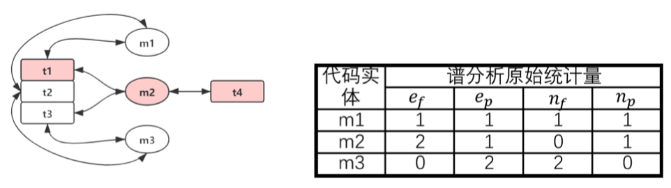
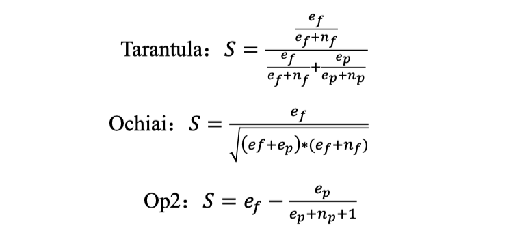
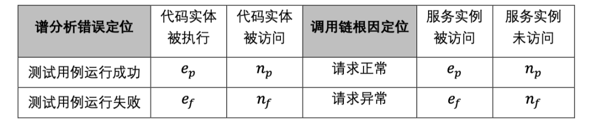
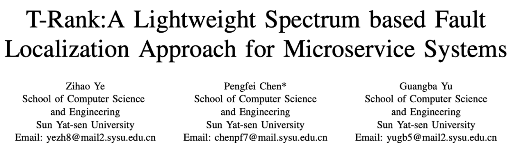
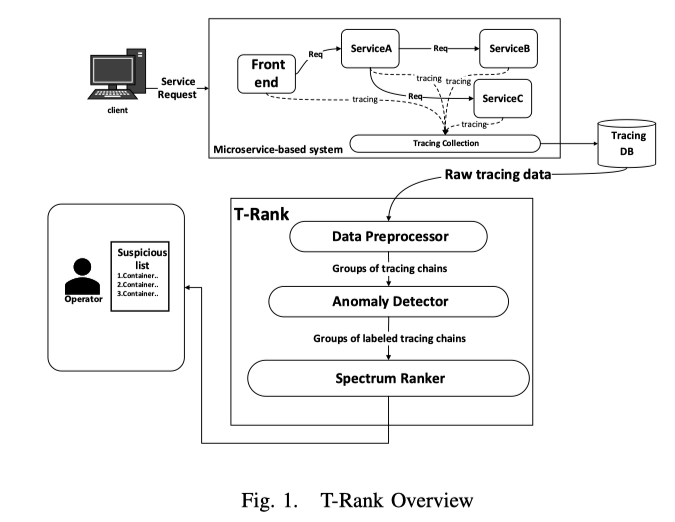
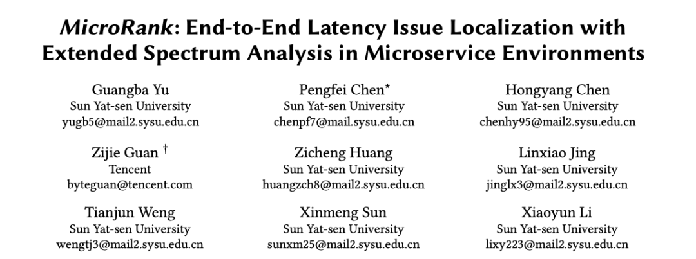
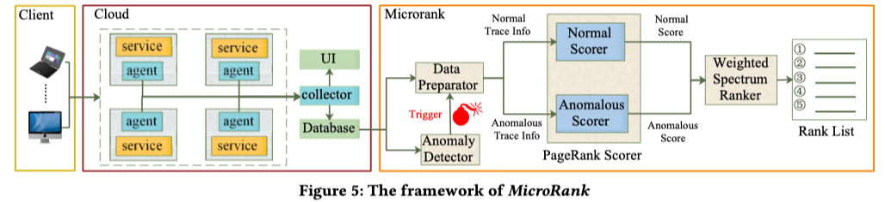

今日立春，东风吹散梅梢雪，一夜挽回天下春。

之前我在 [基于 Traces 的根因定位（一）: Trace 的演进之路](https://yuxiaoba.github.io/post/trace_based_rca_1/) 简单地介绍了 Trace 的出现及其演进的过程。下面我将总结第一种基于 Trace 的根因定位算法：基于 Spectrum-Based Fault Localization（SFL，基于程序频谱的故障定位）算法的 Trace 根因定位算法。​

首先我们介绍一下什么是 SFL ？

SFL 是软件测试领域定位故障常用的一种方法。该方法通过测试用例对被测函数（代码实体）的覆盖情况以及测试用例成功或失败来对潜在的代码错误进行定位。

具体地，对于某个函数 𝑓 ， 𝑒𝑝 为覆盖了该函数并成功运行的测试用例的数量， 𝑒𝑓 为覆盖了该函数但运行失败测试用例的数量， 𝑛𝑝 为未覆盖该函数并成功运行的测试用例的数量， 𝑛𝑓 为未覆盖该函数并运行失败测试用例的数量。最后通过一些数学公式，利用这四个原始统计量计算各个函数的得分。

如下图是一个由 3 个被测函数和 4 个测试用例的示意图，其中函数 m2 存在代码错误，而且是条件触发的，所有标红的函数和测试用例都出现了错误。下表中给出了不同函数的 SFL 原始统计量的取值。

根据数学推理和证明，已经有许多 SFL 计算公式，如

根据 Tarantula 计算方式，上图中 m1、m2、m3 的SBFL的得分分别为 0.5、0.57 和 0，显示代码错误发生在 m2。

我们通过上面的例子可以观察到，每条测试用例经过的程序路径，与 Trace 在分布式系统中的运行路径是相似的

由此我们尝试将 SFL 应用到 Trace 的根因定位中，下面我简单介绍一下我们在这方面的工作。

## 
 01

### 
21_CCGrid_T-Rank:A Lightweight Spectrum based Fault Localization Approach for Microservice Systems

**论文简介:** T-Rank 将微服务的 Trace 作为输入，首先根据 Trace 经过的服务实例的次数对 Trace 进行分类。接着对每个类别的 Trace，Anomly Detector 通过对 3-sgima 找到该类别中请求延迟异常的 Trace 并判定为异常 Trace，其他 Trace 则归为正常 Trace。最后根据 表 1 的对应关系，将异常 Trace 和 正常 Trace 输入到 SFL 计算公式中得出最后的根因。

> 论文链接：[https://yuxiaoba.github.io/publication/trank/trank.pdf](https://yuxiaoba.github.io/publication/trank/trank.pdf)

## 
 02

### 
21_WWW_MicroRank: End-to-End Latency Issue Localization with Extended Spectrum Analysis in Microservice Environments

**论文简介:** 经过更深的研究，像 T-Rank 这样将 Trace 数据简单地输入到 SFL 中只考虑了 Trace 的覆盖信息，没有考虑 Trace 它所携带的服务依赖信息，导致无法处理一些  SFL 得分相同的情况。 因此我们提出了能够将服务依赖信息也融入进 SFL 计算的 MicroRank 根因定位框架。

与 T-Rank 类似的，MicroRank 首先根据 Trace 的延迟将 Trace 划分为异常 Trace 和 正常 Trace。然后  MicroRank 根据正常和异常 Trace 分别构建出正常，异常 operation-trace 图，并在这两个图上利用 PageRank 算法计算出每个 operation 的正常和异常的权重。最后，MicroRank 基于权重与覆盖统计信息相乘的结果计算 SFL 来得到根因。

**个人评论**：这两篇论文都是我自己写的，所以可以不需要顾忌，可以直接光明正大的嫌弃自己。基于 SFL 的 Trace 根因定位算法，从思想上是非常容易理解的，但是在实际应用中还是存在几个问题：

- 基于 SFL 的 Trace 根因定位算法非常依赖于正常和异常 Trace 的判断结果，但是想要很好地判断哪些 Trace 是正常，哪些 Trace 是异常，其实并不容易。我们不仅需要考虑 Trace 的延迟，还需要考虑 Trace 的返回码， Trace 的结构等等。一旦正常和异常 Trace 判定错了，也会影响到方法的准确率。 

- 基于 SFL 的 Trace 根因定位算法非常依赖于 Trace 的质量，如果 Trace 的质量比较差，有很多的莫名其妙的断链，实际用起来准确率也会大打折扣。

- 基于 SFL 的 Trace 根因定位算法目前更倾向于去解决 Microservice 的性能问题，而不是可用性问题，在可用性问题上还需要进一步讨论。

> 论文链接：[https://yuxiaoba.github.io/publication/microrank/microrank.pdf](https://yuxiaoba.github.io/publication/microrank/microrank.pdf)

以上我简单介绍了基于 SFL 的 Trace 根因定位算法的思路，相对来说，这种基于统计的根因定位方法比基于深度学习的方法，更容易让运维工程师理解，可解释性也更强。但是要实际地落地，还需要进一步的研究，希望未来我们还会在这个领域有更大的进展。

CloudWeekly 每周分享与云计算相关论文，相关的论文集被收纳到 github 仓库 [https://github.com/IntelligentDDS/awesome-papers](https://github.com/IntelligentDDS/awesome-papers)