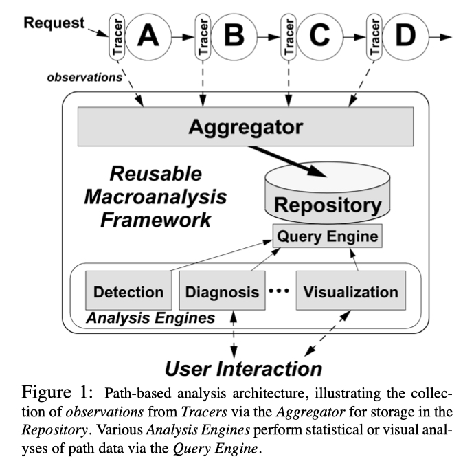
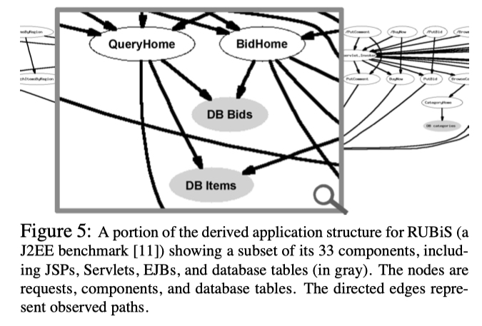
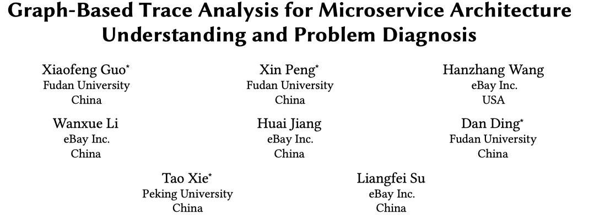
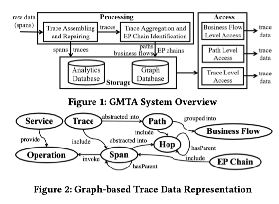
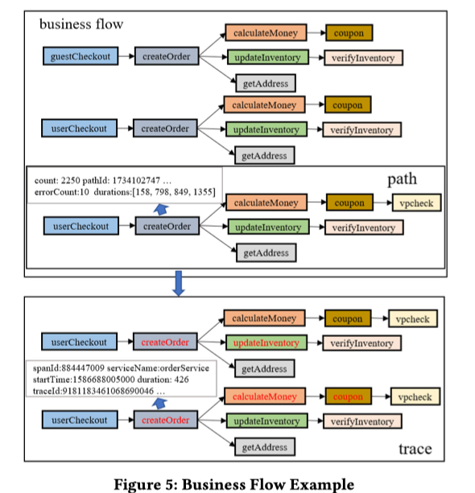
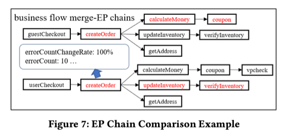

今日雨水，小楼一夜听春雨，深巷明朝卖杏花。

之前我在 [基于 Traces 的根因定位（一）: Trace 的演进之路](https://yuxiaoba.github.io/post/trace_based_rca_1/) 简单地介绍了 Trace 的出现及其演进的过程。在 [基于 Trace 的根因定位（二）： Spectrum-Based Fault Localization 算法](https://yuxiaoba.github.io/post/trace_based_rca_2/) 中介绍了基于 Spectrum-Based Fault Localization（SFL，基于程序频谱的故障定位）算法的 Trace 根因定位算法。​

这一期我们再来讨论一下另外一种基于 Trace 的根因定位算法：Trace 路径抽象。

路径（Path）是请求在系统中运行路径的抽象，它记录了同一类请求经过的组件的性能和交互关系。

例如对于五个 Trace：
a → b → c → d

a → e → f

a → b → c → d

a → e → f

a → e → f

我们可以将其抽象为两个 Path：
a → b → c → d

a → e →f

然后可以通过统计分析，计算每个组件的平均延迟。

基于 Trace 路径抽象进行根因定位的核心思想是：如果我们预先对没有故障的（fault-free）阶段的 Trace 进行 Path 的抽象，那么在故障发生（fault-suffering）阶段我们可以通过比对当前时间窗口的 Path 与历史的 Path 是否表现一致来检测异常和定位根因。

## 
 01

### 
04_NSDI_Path-Based Failure and Evolution Management

**论文简介:** 论文以 Trace 作为输入，在根因定位时主要分为两个步骤：

第一步首先是检测哪些 Path 表现异常，其中包括结构异常和性能异常

- 对结构异常，论文首先通过 probabilistic context free grammar (PCFG) 根据训练过程中 的 fault-free data 抽象出 Path，并对给定 Path 发生的可能性进行建模。在生产阶段，如果抽象出来的 Path 不符合训练的 PCFG 模型，那么认为这个 Path 的结构是异常的

- 对性能异常，系统延迟的偏差往往是问题的信号。尾延迟的增加可能表明部分故障，而平均延迟的增加可能表明过载。延迟的减少可能是由于错误造成的阻止一个请求执行完成

第二步是定位根因，其中包括只有一种 Path 异常和多种 Path 异常发生的情况

- 对只有一种 Path 异常，论文通过 Path 所体现的控制流引导着本地日志分析工具的使用，以将组件的细节与特定的请求联系起来。如果没有 Path ，单个组件的日志就不那么有用了，因为缺乏日志条目和其他系统状态之间的关联

- 对多种 Path 异常的情况，其核心思想是搜索组件的使用和失败的请求之间的相关性。论文通过训练一个决策树模型来区分成功和失败的类别，其中导致失败的树边成为根因的候选

下图展示了论文的可视化界面

**个人评论**：论文来自 UC Berkeley David Patterson 的 20 年前发表在 NSDI （CCF A）的古董论文，对 Trace 已经有很深刻的见解，并且已经尝试使用 log 和 trace 的融合进行根因定位。20 年后的 Trace 分析方法也没有能逃出这个分析框架，只能说 RiseLab YYDS。

> 论文链接：[https://www.usenix.org/conference/nsdi-04/path-based-failure-and-evolution-management](https://www.usenix.org/conference/nsdi-04/path-based-failure-and-evolution-management)

## 
 02

### 
20_FSE_Graph-Based Trace Analysis for Microservice Architecture Understanding and Problem Diagnosis

**论文简介:** 论文提出一种基于图形分析的微服务架构理解和问题诊断方法 GMTA。GMTA 将微服务中的 Trace 转换为Graph ，通过 Graph 的分析和可视化来发现微服务架构中的问题和瓶颈。它主要提供了四种 Graph 的展示方式：Trace, Path, BusinessFlow 和 Error Propagation Chains （EP Chains）

- Trace：GMTA 根据 Trace ID 对同一个请求的 Span 进行聚合，然后对一些缺乏 Root Span 和没有 Parent span 的 Trace 进行了修复
- Error Propagation Chains：给定一个带有 error attribute 的 Span，GMTA 检查该 Span 的一个Child Span 是否也有错误标记，从而构建出 EP Chains
- Path: 对每一条 Trace，GMTA 根据 Trace 访问的微服务名称和操作名称进行哈希，生成 Path ID。如果 Path ID 已经存在，那么更新 Path 的属性（如trace数、平均延迟等）。如果 Path 不存在，便为这条 Trace创建一个新 Path。
- Business Flow: 由运维人员按需求制定的调用某个微服务与当前操作之前/之后会调用某个微服务 的任意组合。
  

最后 GMTA Explorer提供4类主要功能。前面两个可视化相关功能主要用于系统架构理解、后面两个功能主要用于故障诊断。下面是可视化的几个样例。

**个人评论**：论文是 eBay 与复旦大学彭鑫老师团队合作发表的论文。论文更多的是针对于 Path 的抽象和可视化的展示，对根因定位的自动化考虑的还是比较少。

> 论文链接：[https://taoxie.cs.illinois.edu/publications/esecfse20in-trace.pdf](https://taoxie.cs.illinois.edu/publications/esecfse20in-trace.pdf)

从 2004 年到 2020 年，16 年的时间里可观测性有了很大的发展，分布式的场景让 Trace 已经走进千家万户。现在大型互联网厂商每日产生的 Trace 数目上百亿条，手动地分析和查看单条 Trace 越来越不实际。对同种类型的 Trace 的路径进行抽象，再具象化，能够更直观地反映当前某种请求的处理状态，降低运维工程师的运维压力。但目前基于 Trace 路径抽象方法的根因定位大多还是 UI 展示功能，根因定位自动化能力不足，未来还需继续研究。

CloudWeekly 每周分享与云计算相关论文，相关的论文集被收纳到 github 仓库 [https://github.com/IntelligentDDS/awesome-papers](https://github.com/IntelligentDDS/awesome-papers)