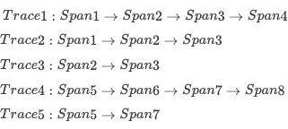
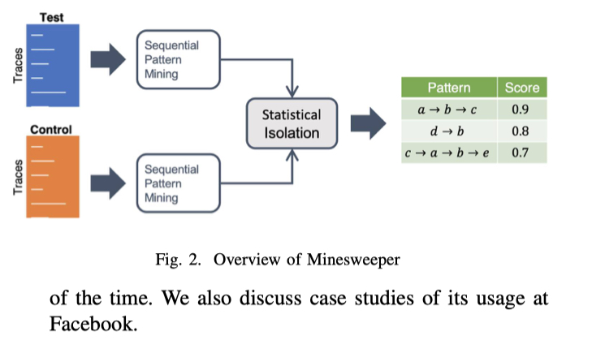
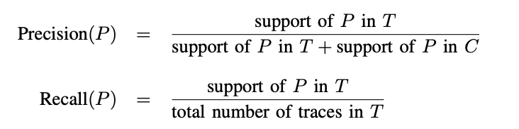
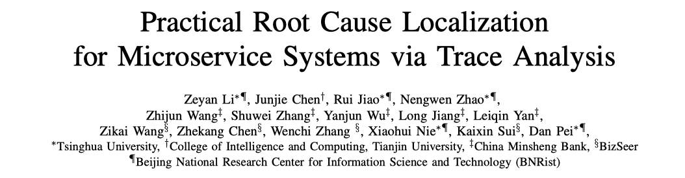
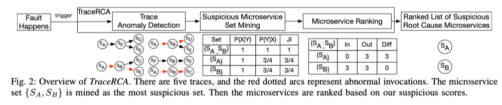

今日雨水，小楼一夜听春雨，深巷明朝卖杏花。

之前我在 [基于 Traces 的根因定位（一）: Trace 的演进之路](https://yuxiaoba.github.io/post/trace_based_rca_1/) 简单地介绍了 Trace 的出现及其演进的过程。在 [基于 Trace 的根因定位（二）： Spectrum-Based Fault Localization 算法](https://yuxiaoba.github.io/post/trace_based_rca_2/) 中介绍了基于 Spectrum-Based Fault Localization（SFL，基于程序频谱的故障定位）算法的 Trace 根因定位算法。​在 [基于 Trace 的根因定位（三）：Trace 路径抽象](https://yuxiaoba.github.io/post/trace_based_rca_3/) 介绍了如何用路径抽象定位根因。

这一期我们再来讨论一下另外一种基于 Trace 的根因定位算法：Trace 频繁模式挖掘。频繁模式，在 Trace 根因定位的背景下，可以理解为在一段时间内所有 Trace 中，出现频率较高的连续的 Span 集合。

举个例子🌰，下图中有 5 条 Trace，

其中 (Span2 Span3) 可以视为在 Trace 集合中出现的模式（Pattern）。传统的频繁模式挖掘方法通常并不在意 Pattern 中的项的前后依赖关系，但是在 Trace 的分析中，我们应该只考虑那些连续的有父子关系的Pattern，如(Span2 Span3 Span4)， 而没有直接父子关系的 Pattern (Span2 Span4) 则不被考虑。

这是因为 (Span2 Span4)  仅提供了 Span2 和 Span4 一起出现的证据，这个模式被破坏在根因定位中提供的作用较小。而 (Span2 Span3 Span4) 提供的是 Span2 调用了 Span3，且 Span3 调用了 Span4 的情况，如果这个模式被破坏则说明这个子调用链发生了问题，值得运维工程师关注。

确定一个 Pattern 出现是否是频繁模式（Frequent Pattern），可以通过计算这个 Pattern 的支持度（support）来衡量。一种 Pattern 的  support 是指在所有 Trace 集合中这个 Pattern 出现的频率。如上图中 (Span2 Span3) 的 support 是 3 ，因为它一共出现了三次。 通常我们会定义一个最小支持度的阈值 Support_min 来进行划分。也就是说，如果一个 Pattern 的 support > Support_min, 那么判定这个 Pattern 属于 Frequent Pattern。 

在获得 Frequent Pattern 后，利用它们进行根因定位的核心思想是：对比正常 Trace 的频繁模式和异常 Trace 的频繁模式的差异，或者对比正常时间段 Trace 的频繁模式和异常时间段 Trace 的频繁模式的差异，找到只在异常时候发生，不在正常时候发生的频繁模式，从而将这些频繁模式判定为根因。

这个思路是比较直观的且可解释的，如果一个 Pattern 在正常的时候经常发生，但是在异常的时候不发生了，那么很有可能这个 Pattern 是因为故障发生导致它没有按正常的路径运行，运维工程师应该优先检查这个 Pattern。或者如果一个Pattern 之前从不发生，但是在异常的时候发生频繁了，那么很有可能是故障的发生导致它变频繁，也应该优先检查这个 Pattern。而在正常阶段和异常阶段发生频率相似的模式，是不太需要关注的。

下面我再简单介绍两篇使用频繁模式挖掘进行根因定位的论文。

## 
 01

### 
21_ICSE_Scalable Statistical Root Cause Analysis on App Telemetry

**论文简介:** 论文提出了一个可扩展统计根因定位框架 Minesweeper。 Minesweeper 以没有故障的 Test 阶段的 Trace 和包含故障的 Control 阶段的 Trace 作为输入。 它首先通过 PrefixSpan 算法分别挖掘出 Test 和 Control 阶段的  Frequent Pattern 的 support 。

对每一个 Frequent Pattern P，Minesweeper 会根据下面的公式计算出它的 Precision 和 Recall 

这里 Precision 描述了一个 P 在 Test 阶段出现，不在 Control 阶段出现的概率，也就是说在 T 中频繁出现，在 C 中出现不频繁的 P 可疑得分更高。Recall 描述了 P 能覆盖多少 Test 阶段的 Trace，它表示了 P 在 Test 阶段的代表性，越有代表性越重要。最后为了综合考虑两个参数，一个  Frequent Pattern 的可疑性是通过计算它的 F1-Score 得出的。

**个人评论**：这篇论文是 Facebook 在 2021 年发表在 CCF A 类会议 ICSE 的 Industry Track 上的论文。Minesweeper 来自工业界的真实实践，使用简单的统计方法，可解释性比较强。不过论文似乎没有考虑并发和异步调用的情况。

> 论文链接：[https://arxiv.org/abs/2010.09974](https://arxiv.org/abs/2010.09974)

## 
 02

### 
21_IWQoS_Practical Root Cause Localization for Microservice Systems via Trace Analysis

**论文简介:** 论文提出了一个 Spectrum 算法与频繁模式挖掘相结合的无监督根因定位算法 TraceRCA。TraceRCA 以一个时间窗口的 Trace 为输入，然后使用一个无监督多度量异常检测方法检测出异常的 Trace。Trace 异常检测是另外一个内容了，这里先不细说，我先挖个坑，以后再专门统一对 Trace 异常检测的论文进行分析。

在划分好正常的 Trace 和异常的 Trace后，TraceRCA 通过 FP-Growth 算法 来挖掘满足支持度阈值的 Frequent Pattern （即可疑的微服务集），然后计算出 Frequent Pattern  的支持度 (support )和置信度 (confidence) 。

其中 support = P(X|Y)，X指的是通过某个 Pattern 的所有 Trace，Y是指所有异常的 Trace，这个 P 指的是在所有异常 Trace 中经过该 Pattern 的异常 Trace比例。 confidence = P(Y|X)，指的是所有经过该 Pattern 的 Trace中，异常 Trace所占的比例。

接着 TraceRCA 计算他们的 Jaccard Index (JI) 得分，也就是 support 和 confidence 的调和平均数，获得 Pattern 的可疑得分。

**个人评论**：论文是清华大学裴丹老师团队 2021 年发表在 CCF B 类会议 IWQoS 上的。与前面 Facebook 的方案比较大的不同是，TraceRCA 需要事先检测出异常的 Trace，这个 Trace 异常检测的效果会对后面根因定位的结果有较大的影响。并且对每条 Trace 进行准确异常检测，不仅难度比较大，计算的量也比较大，一定程度上限制了 TraceRCA 的使用。

> 论文链接：[https://netman.aiops.org/wp-content/uploads/2021/05/1570705191.pdf](https://netman.aiops.org/wp-content/uploads/2021/05/1570705191.pdf)
> 代码链接：[https://github.com/NetManAIOps/TraceRCA](https://github.com/NetManAIOps/TraceRCA)

最后再来小结一下，与 Trace 路径抽象 中输出粗粒度的 Trace 路径不同，频繁模式挖掘最后输出的是一个更细粒度的路径子集，能够帮助运维工程师更快地聚焦到故障点。此外，基于统计的计算方式以及较强的可解释性，也为这种方法在工业界实际应用提供了可能。

CloudWeekly 每周分享与云计算相关论文，相关的论文集被收纳到 github 仓库 [https://github.com/IntelligentDDS/awesome-papers](https://github.com/IntelligentDDS/awesome-papers)