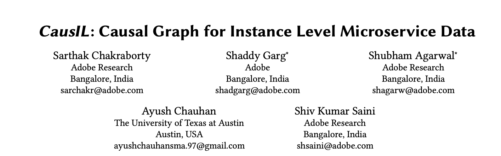
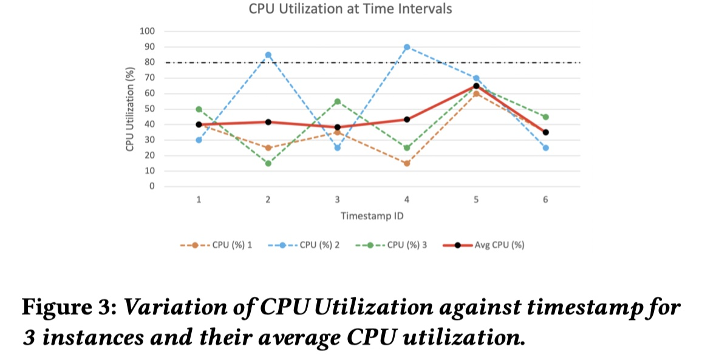
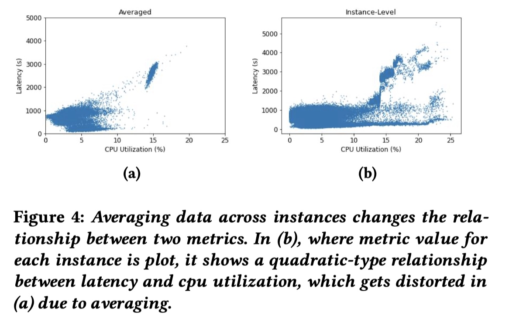
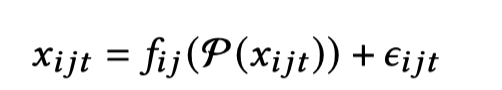
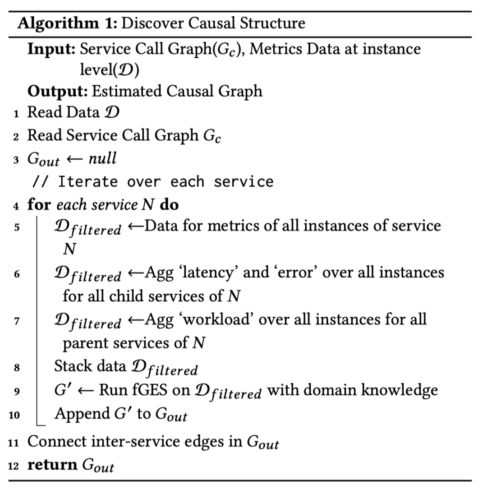
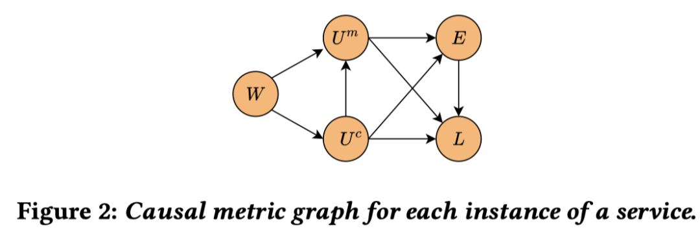

WWW 全称 World Wide Web Conference，又称 The Web Conference，是一个CCF A 类的，旨在促进互联网技术的研究与发展国际性学术会议。

WWW 的历史可以追溯到 1994 年，首次会议在瑞士日内瓦举行。该会议汇集了来自学术界、产业界、政府和非营利组织的研究人员、开发者和实践者，共同探讨和分享有关互联网技术的最新进展、创新应用和未来发展方向。

WWW 2023 将于 2023年4月30日至5月4日在美国举行。本次会议共收到 1900 篇投稿， 录用了 365 篇，录用率为 19.2%。我们实验室投了一篇，做了分母。在这个链接 https://www2023.thewebconf.org/program/accepted-papers/ 中可以看到全部接收的 Paper。

下面跟随本文追踪 WWW 2023 中云计算领域的最新研究吧。

## 
 01

### 
2023_WWW_Diagnostor: An Ambiguity-Aware Root Cause Localization Approach Based on Call Metric Data

**论文简介:** 论文提出了一个无监督的通过分析服务之间 Call Metric 的因果关系进行根因定位方法 CMDiagnostor。这种指标根因定位的思路我们之前在 基于 Metrics 的根因定位 (二)：因果关系图 中概述过，它主要是通过Metrics 之间的依赖关系构建出调用关系图，然后基于相关性或随机游走算法在图上游走从而定位出根因。这种根因定位方法的准确性极大地依赖于调用关系图的构建是否准确。CMDiagnostor 的主要贡献就是优化了调用关系图的构建方式。

传统的调用图构建方式受限于 Call Metric 的有限信息，构建出的调用图有可能会带有歧义（Ambiguity）。 这里的歧义如下图所示，（a）中是 Call Metric 中包含的调用关系，（b）是根据这些调用关系组合出来的调用图。但是（b）的调用图在实际的运行中，可能包含（c）中的多种可能的控制流，这就导致了文章所言的歧义。

如果没有对上文的歧义进行进一步的划分，因果关系图的构建是不够准确的，从而也会影响到根因定位的准确性。CMDiagnostor 提出了一种流量回归方法（称为AmSitor）来处理模糊性，并构建无模糊调用图。其核心思想是：将一个下游流量与其可能的上游流量进行线性回归，每个上游流量的回归系数可以被视为其期望值。具有低系数（例如，小于或等于 0.005）的上游将被剪枝掉。

通过 AmSitor 进行剪枝，CMDiagnostor 就可以去除掉调用图中带有的歧义，剩下的根因定位过程（如下图所示）与我们之前分享的  MicroHECL 和 Microscope 大同小异，感兴趣也可看一下 [基于 Metrics 的根因定位 (二)：因果关系图](https://yuxiaoba.github.io/post/metric_based_rca_2/) 。

这里 Precision 描述了一个 P 在 Test 阶段出现，不在 Control 阶段出现的概率，也就是说在 T 中频繁出现，在 C 中出现不频繁的 P 可疑得分更高。Recall 描述了 P 能覆盖多少 Test 阶段的 Trace，它表示了 P 在 Test 阶段的代表性，越有代表性越重要。最后为了综合考虑两个参数，一个  Frequent Pattern 的可疑性是通过计算它的 F1-Score 得出的。

**个人评论**：CMDiagnostor 是清华大学裴丹老师的团队，话题是一个老话题，但是裴老师的团队又做出了新的创新点，不失为在没有 Trace 的情况下的一种解决方式吧。但是如果系统的 Trace 已经比较完善，应该是还是使用 Trace 能获得更准确的调用关系。

> 论文链接：[https://netman.aiops.org/wp-content/uploads/2023/02/CMDiagnostor_www_2023.pdf](https://netman.aiops.org/wp-content/uploads/2023/02/CMDiagnostor_www_2023.pdf)
> 代码链接：[https://github.com/NetManAIOps/CMDiagnostor](https://github.com/NetManAIOps/CMDiagnostor)

## 
 02

### 
2023_WWW_CausIL: Causal Graph for Instance Level Microservice Data

**论文简介:** 论文为微服务系统提出一个服务实例级别（service instance level）的因果关系图构建框架 CausIL 。传统的因果构建图方式如 MicroHECL、Microscope 和上文的 CMDiagnostor 一般都是在服务级别（service level）构建因果关系图，这种构造方式对 instance level metric 进行聚合，可能会平滑了某个服务实例的异常表现。如下图两个例子都是在服务级别进行 metric 的 average 后导致了失真，从而影响到后面的根因定位。

为了克服在服务级别构建因果关系图的缺陷，本文就提出了构建服务实例级别的因果关系图。对于微服务S，设 x_ijt 是服务 S 的第 j 个实例在 t 时间的第 i 的指标，假设child metric  x_ijt 是因果依赖于 parent metric 集合 P( x_ijt )，那给定 P( x_ijt ) 下， 图片的条件分布可以表示为:

因果关系估计算法的任务是识别每个 metric 的 parent metric P( x_ijt ) 以及因果函数 f_ij(.)。给定每个 child metric 的因果parent metric，通过估计器 f_ij(.) 估计 parent metric 和 child metric 之间的因果关系的强度。 CausIL 使用 Fast Greedy Equivalence Search（fGES）和 Bayesian Information Criterion (BIC) 进行因果发现

**个人评论**：这篇论文是 Adobe 印度研究院的团队发表的论文，最大的贡献是把因果关系细粒度化到服务实例级别，这么简单的 idea 我之前怎么没想到 。除此之外，论文里还融入了一些 domain knowledge，这些在工业界的实践值得参考

在任何情况下，同一服务中的任何其他 metric 都不会影响 workload
latency 不会影响 resource 利用率。
如果服务之间在调用图上没有连接，禁止服务之间的所有因果关联
对服务内部的 metric 之间的因果关系进行假设（如下图）

> 论文链接：[https://arxiv.org/abs/2303.00554](https://arxiv.org/abs/2303.00554)
> 代码链接：[https://github.com/sarthak-chakraborty/CausIL](https://github.com/sarthak-chakraborty/CausIL)

最后再来小结一下，今天我们分享了两篇在 WWW 2023 上有关因果关联的工作，在因果关联的这颗老树上又发出了新芽，而且这两篇论文，尤其是第二篇论文，都是有实际落地的可能，值得我们学习。

CloudWeekly 每周分享与云计算相关论文，相关的论文集被收纳到 github 仓库 [https://github.com/IntelligentDDS/awesome-papers](https://github.com/IntelligentDDS/awesome-papers)