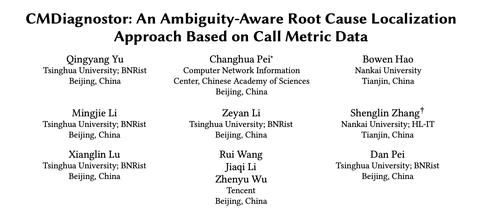
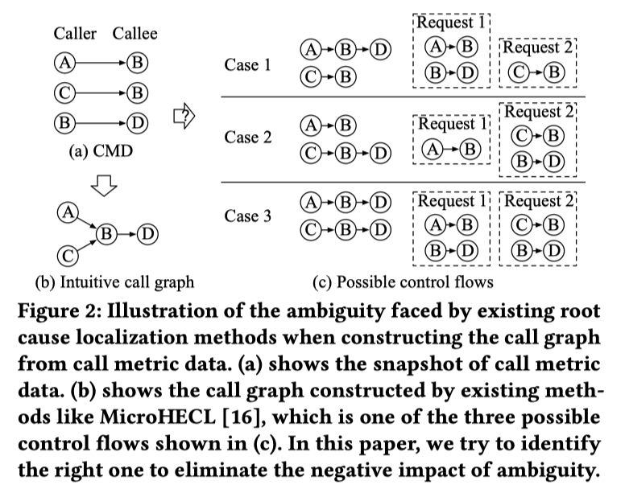
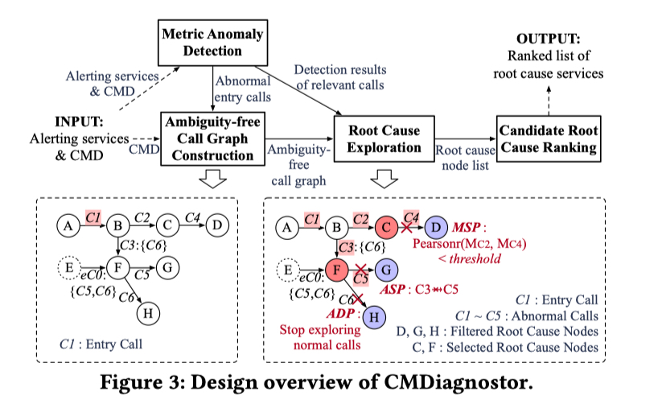

WWW 全称 World Wide Web Conference，又称 The Web Conference，是一个CCF A 类的，旨在促进互联网技术的研究与发展国际性学术会议。

WWW 的历史可以追溯到 1994 年，首次会议在瑞士日内瓦举行。该会议汇集了来自学术界、产业界、政府和非营利组织的研究人员、开发者和实践者，共同探讨和分享有关互联网技术的最新进展、创新应用和未来发展方向。

WWW 2023 将于 2023年4月30日至5月4日在美国举行。本次会议共收到 1900 篇投稿， 录用了 365 篇，录用率为 19.2%。我们实验室投了一篇，做了分母。在这个链接 https://www2023.thewebconf.org/program/accepted-papers/ 中可以看到全部接收的 Paper。

下面跟随本文追踪 WWW 2023 中云计算领域的最新研究吧。

## 
 01

### 
2023_WWW_Diagnostor: An Ambiguity-Aware Root Cause Localization Approach Based on Call Metric Data

**论文简介:** 论文提出了一个无监督的通过分析服务之间 Call Metric 的因果关系进行根因定位方法 CMDiagnostor。这种指标根因定位的思路我们之前在 基于 Metrics 的根因定位 (二)：因果关系图 中概述过，它主要是通过Metrics 之间的依赖关系构建出调用关系图，然后基于相关性或随机游走算法在图上游走从而定位出根因。这种根因定位方法的准确性极大地依赖于调用关系图的构建是否准确。CMDiagnostor 的主要贡献就是优化了调用关系图的构建方式。

传统的调用图构建方式受限于 Call Metric 的有限信息，构建出的调用图有可能会带有歧义（Ambiguity）。 这里的歧义如下图所示，（a）中是 Call Metric 中包含的调用关系，（b）是根据这些调用关系组合出来的调用图。但是（b）的调用图在实际的运行中，可能包含（c）中的多种可能的控制流，这就导致了文章所言的歧义。

如果没有对上文的歧义进行进一步的划分，因果关系图的构建是不够准确的，从而也会影响到根因定位的准确性。CMDiagnostor 提出了一种流量回归方法（称为AmSitor）来处理模糊性，并构建无模糊调用图。其核心思想是：将一个下游流量与其可能的上游流量进行线性回归，每个上游流量的回归系数可以被视为其期望值。具有低系数（例如，小于或等于 0.005）的上游将被剪枝掉。

通过 AmSitor 进行剪枝，CMDiagnostor 就可以去除掉调用图中带有的歧义，剩下的根因定位过程（如下图所示）与我们之前分享的  MicroHECL 和 Microscope 大同小异，感兴趣也可看一下 [基于 Metrics 的根因定位 (二)：因果关系图]() 。

这里 Precision 描述了一个 P 在 Test 阶段出现，不在 Control 阶段出现的概率，也就是说在 T 中频繁出现，在 C 中出现不频繁的 P 可疑得分更高。Recall 描述了 P 能覆盖多少 Test 阶段的 Trace，它表示了 P 在 Test 阶段的代表性，越有代表性越重要。最后为了综合考虑两个参数，一个  Frequent Pattern 的可疑性是通过计算它的 F1-Score 得出的。

**个人评论**：这篇论文是 Facebook 在 2021 年发表在 CCF A 类会议 ICSE 的 Industry Track 上的论文。Minesweeper 来自工业界的真实实践，使用简单的统计方法，可解释性比较强。不过论文似乎没有考虑并发和异步调用的情况。

> 论文链接：[https://arxiv.org/abs/2010.09974](https://arxiv.org/abs/2010.09974)

## 
 02

### 
21_IWQoS_Practical Root Cause Localization for Microservice Systems via Trace Analysis

**论文简介:** 论文提出了一个 Spectrum 算法与频繁模式挖掘相结合的无监督根因定位算法 TraceRCA。TraceRCA 以一个时间窗口的 Trace 为输入，然后使用一个无监督多度量异常检测方法检测出异常的 Trace。Trace 异常检测是另外一个内容了，这里先不细说，我先挖个坑，以后再专门统一对 Trace 异常检测的论文进行分析。

在划分好正常的 Trace 和异常的 Trace后，TraceRCA 通过 FP-Growth 算法 来挖掘满足支持度阈值的 Frequent Pattern （即可疑的微服务集），然后计算出 Frequent Pattern  的支持度 (support )和置信度 (confidence) 。

其中 support = P(X|Y)，X指的是通过某个 Pattern 的所有 Trace，Y是指所有异常的 Trace，这个 P 指的是在所有异常 Trace 中经过该 Pattern 的异常 Trace比例。 confidence = P(Y|X)，指的是所有经过该 Pattern 的 Trace中，异常 Trace所占的比例。

接着 TraceRCA 计算他们的 Jaccard Index (JI) 得分，也就是 support 和 confidence 的调和平均数，获得 Pattern 的可疑得分。

**个人评论**：论文是清华大学裴丹老师团队 2021 年发表在 CCF B 类会议 IWQoS 上的。与前面 Facebook 的方案比较大的不同是，TraceRCA 需要事先检测出异常的 Trace，这个 Trace 异常检测的效果会对后面根因定位的结果有较大的影响。并且对每条 Trace 进行准确异常检测，不仅难度比较大，计算的量也比较大，一定程度上限制了 TraceRCA 的使用。

> 论文链接：[https://netman.aiops.org/wp-content/uploads/2021/05/1570705191.pdf](https://netman.aiops.org/wp-content/uploads/2021/05/1570705191.pdf)
> 代码链接：[https://github.com/NetManAIOps/TraceRCA](https://github.com/NetManAIOps/TraceRCA)

最后再来小结一下，与 Trace 路径抽象 中输出粗粒度的 Trace 路径不同，频繁模式挖掘最后输出的是一个更细粒度的路径子集，能够帮助运维工程师更快地聚焦到故障点。此外，基于统计的计算方式以及较强的可解释性，也为这种方法在工业界实际应用提供了可能。

CloudWeekly 每周分享与云计算相关论文，相关的论文集被收纳到 github 仓库 [https://github.com/IntelligentDDS/awesome-papers](https://github.com/IntelligentDDS/awesome-papers)