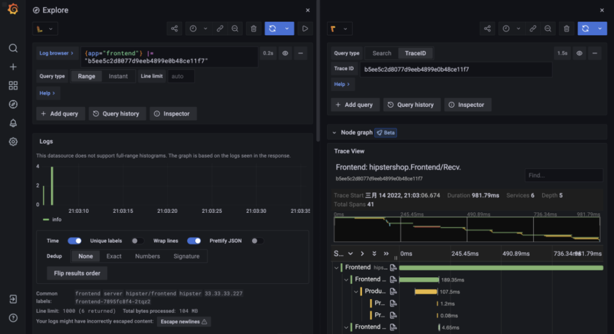

Online Boutique is a cloud-native microservices demo application. Online Boutique consists of a 10-tier microservices application. The application is a web-based e-commerce app where users can browse items, add them to the cart, and purchase them. Google uses this application to demonstrate use of technologies like Kubernetes, Istio, Stackdriver, gRPC. This application works on any Kubernetes cluster (such as a local one). It’s easy to deploy with little to no configuration.

We  instrument the Opentelemetry API for each service to obtain traces and insert Trace ID and Span ID into each log to enhance observability.

This Augmented-Online Boutique is open-sourced by FSE 2023 paper [Nezha](https://yuxiaoba.github.io/publication/nezha23/)

