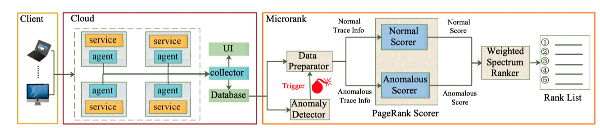

MicroRank is a novel system to locate root causes that lead to latency issues in microservice environments.

MicroRank extracts service latency from tracing data then conducts the anomaly detection procedure.

By combining PageRank and spectrum analysis, the service instances that lead to latency issues are ranked with high scores.

